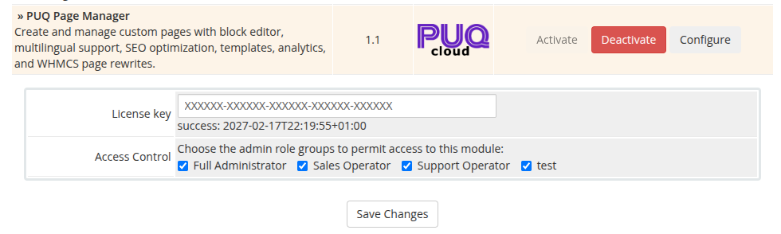

# Activation and permissions

### PUQ Page Manager module **[WHMCS](https://puqcloud.com/link.php?id=77)**
##### [Order now](https://puqcloud.com/whmcs-addon-puq-page-manager.php) | [Download](https://download.puqcloud.com/WHMCS/addons/PUQ_WHMCS-Page-Manager/) | [Community](https://community.puqcloud.com/)

To activate the module and set up permissions, follow these steps:

1. Log in to your WHMCS Admin Area.
2. Navigate to **System Settings > Addon Modules** (or **Setup > Addon Modules** in older WHMCS versions).
3. Locate **PUQ Page Manager** in the list and click **Activate**.
4. Once activated, click **Configure** next to the module name.
5. In the configuration panel:
   - Enter your **License key** (provided upon purchase).
   - Under **Access Control**, select the administrative role groups (e.g., Full Administrator, Support) that are permitted to access and manage this module.
6. Click **Save Changes**.

*module-activation-access-control.png*
