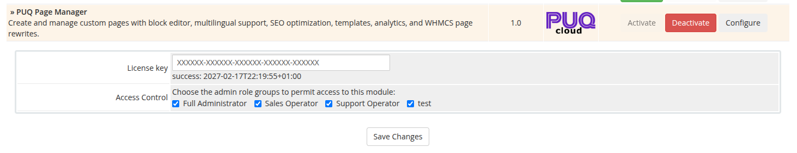

# Installation and Update

### Page Manager addon **[WHMCS](https://puqcloud.com/link.php?id=77)**
#####  [Order now](https://puqcloud.com/store/whmcs-addon-modules) | [Download](https://download.puqcloud.com/WHMCS/addons/PUQ_WHMCS-Page-Manager/) | [FAQ](https://community.puqcloud.com/)

## System Requirements

| Requirement | Minimum |
|-------------|---------|
| **PHP** | 8.1, 8.2 or newer |
| **WHMCS** | 8.x, 9.x or newer |
| **ionCube Loader** | v13 or newer (v14, v15) |

> **Note:** The module uses ionCube encoding. Make sure ionCube Loader is installed and active on your server.

---

## Download

The module can be ordered and downloaded from PUQ Cloud:

- **Order / Download:** [https://puqcloud.com/store/whmcs-addon-modules](https://puqcloud.com/store/whmcs-addon-modules)
- **FAQ:** [https://community.puqcloud.com/](https://community.puqcloud.com/)
- **Direct download links:**

PHP 8.1:
```
wget https://download.puqcloud.com/WHMCS/addons/PUQ_WHMCS-Page-Manager/php81/PUQ_WHMCS-Page-Manager-latest.zip
```

PHP 8.2+:
```
wget https://download.puqcloud.com/WHMCS/addons/PUQ_WHMCS-Page-Manager/php82/PUQ_WHMCS-Page-Manager-latest.zip
```

> All versions are available at: [https://download.puqcloud.com/WHMCS/addons/PUQ_WHMCS-Page-Manager/](https://download.puqcloud.com/WHMCS/addons/PUQ_WHMCS-Page-Manager/)

After downloading, extract the archive:

```
unzip PUQ_WHMCS-Page-Manager-latest.zip
```

---

## Installation

### Step 1: Upload Files

Extract the module archive and upload the `puq_page_manager` directory to the WHMCS addons directory:

```
/your-whmcs/modules/addons/puq_page_manager/
```

Directory structure after upload:

```
modules/addons/puq_page_manager/
    puq_page_manager.php
    hooks.php
    whmcs.json
    version
    logo.png
    lib/
        puqPageManager.php
        puqEditorJSParser.php
        puqWidgetHelpers.php
    lang/
        english.php
    templates/
        header.tpl
        home.tpl
        pages.tpl
        page_edit.tpl
        analytics.tpl
        settings.tpl
        settings_appearance.tpl
        revisions.tpl
        license_required.tpl
        client/
            js_css.tpl
            output_type_editor_js.tpl
            password_prompt.tpl
    templates/js/
        editor.js
    widgets/
        puqannouncement/
        puqcontactform/
        puqcta/
        ... (23 widget directories)
        _shared/
```

### Step 2: Activate the Module

1. Log in to the WHMCS admin panel
2. Go to **Setup** > **Addon Modules**
3. Find **PUQ Page Manager** in the list
4. Click **Activate**

> On activation, the module creates the necessary database tables for pages, translations, revisions, analytics, settings, and rewrites.

### Step 3: Configure the License Key

1. After activation, click **Configure** next to the module
2. Enter your license key in the **License key** field
3. Select admin role groups that should have access to the module
4. Click **Save Changes**

After saving, a verification status will appear below the license key field (e.g., `success: 2027-02-18T01:32:13+01:00`).


*01-addon-config-license.png*

### Step 4: Access the Module

Go to **Addons** > **PUQ Page Manager** to access the dashboard.

---

## Update

### Step 1: Backup

Before updating, we recommend backing up:
- Your WHMCS database
- Module files in `modules/addons/puq_page_manager/`

### Step 2: Upload New Files

Extract the new version and overwrite all files in:

```
/your-whmcs/modules/addons/puq_page_manager/
```

### Step 3: Re-activate (if needed)

If the update adds new database columns, deactivate and re-activate the module:

1. Go to **Setup** > **Addon Modules**
2. Click **Deactivate**, then **Activate** again

> This is safe — the module only creates tables/columns if they don't already exist. Your pages, revisions, analytics, and settings are preserved.

### Step 4: Verify

1. Go to **Addons** > **PUQ Page Manager**
2. Check the version number in the top-right corner of the navigation bar (e.g., `v1.0`)

---

## Deactivation

1. Go to **Setup** > **Addon Modules**
2. Click **Deactivate** next to PUQ Page Manager
3. Confirm the deactivation

> **Warning:** Deactivation drops the module's database tables. All your pages, translations, revisions, analytics data, and settings will be lost. Export your pages before deactivating if you want to preserve them.

---

## License

The module requires an active license for full functionality. The license is verified through the PUQ Cloud license server.

### How License Verification Works

- The module periodically checks license validity at `https://license.puqcloud.com/`
- Verification results are cached in the database for 5 days
- If the license server is temporarily unreachable, the module uses the last cached result

### Without an Active License

- **Dashboard** (Home page) remains fully accessible
- **All other pages** (Pages, Analytics, Settings) display a license required page
- **All AJAX controllers** (except Dashboard) return a 403 error

### After Activating a License

1. The warning banner disappears
2. All pages and features become accessible
3. Enter your license key in **Setup** > **Addon Modules** > **PUQ Page Manager** > **Configure**

### Purchase a License

**[https://puqcloud.com/store/whmcs-addon-modules](https://puqcloud.com/store/whmcs-addon-modules)**

For license-related questions, please contact us via the ticket system:

**[https://puqcloud.com/submitticket.php](https://puqcloud.com/submitticket.php?step=2&deptid=1)**
