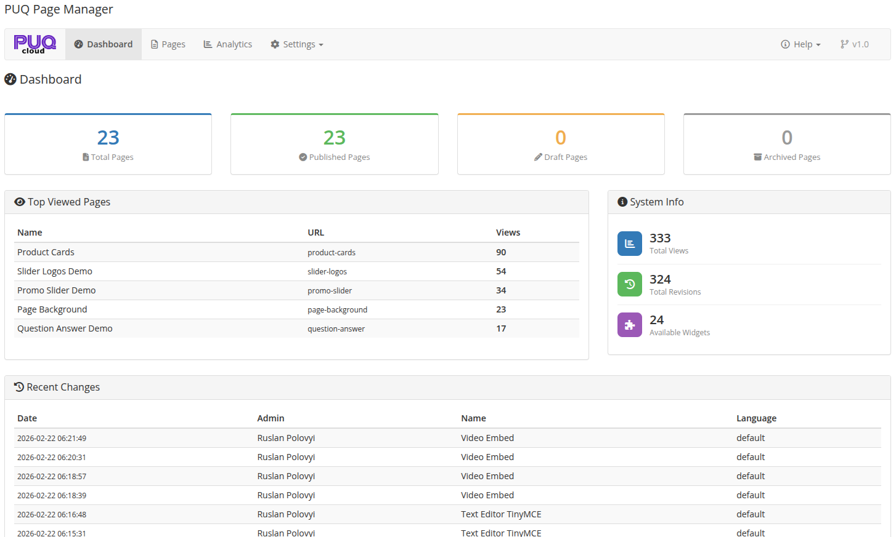

# Admin Area Overview

### PUQ Page Manager module **[WHMCS](https://puqcloud.com/link.php?id=77)**
##### [Order now](https://puqcloud.com/store/whmcs-addon-modules) | [Download](https://download.puqcloud.com/WHMCS/addons/PUQ_WHMCS-Page-Manager/) | [Community](https://community.puqcloud.com/)

This page provides an overview of the administrative interface and actions available to administrators.

## Accessing the Admin Area
To access the admin area of the module:
1. Log in to your WHMCS Admin Area.
2. Navigate to **Addons > PUQ Page Manager** (or the corresponding provisioning menu for server modules).

## Management Actions
The admin interface allows performing the following actions:
- **Create Page**: Click the "Create New Page" button. It generates a default editor page.
- **Export Page**: Download individual page layouts as JSON format.
- **Import Page**: Upload previously exported JSON layouts directly into the builder.
- **Clone Page**: Instantly copy an existing page structure.
- **Delete Page**: Deletes the page configuration.

## Settings
Explain settings and tools:
- **General Settings**: Manage default page, SEO tags, and page rewrites.
- **Analytics**: Track page views, unique views, top pages, and views per day.

## Screenshot

*02-dashboard.png*
