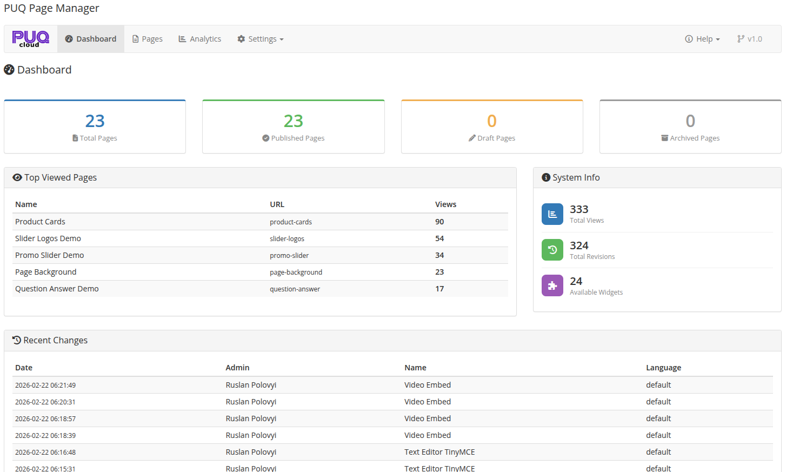

# Dashboard

### Page Manager addon **[WHMCS](https://puqcloud.com/link.php?id=77)**
#####  [Order now](https://puqcloud.com/store/whmcs-addon-modules) | [Download](https://download.puqcloud.com/WHMCS/addons/PUQ_WHMCS-Page-Manager/) | [FAQ](https://community.puqcloud.com/)

The Dashboard is the main screen of PUQ Page Manager. It provides a quick overview of your pages, recent activity, and system information.

*02-dashboard.png*

---

## Overview Cards

At the top of the dashboard, four cards display key statistics:

| Card | Description |
|------|-------------|
| **Total Pages** | Total number of pages created |
| **Published Pages** | Pages with "Published" status |
| **Draft Pages** | Pages with "Draft" status |
| **Archived Pages** | Pages with "Archived" status |

---

## Top Viewed Pages

A table showing the most viewed pages, sorted by total views. Displays the page name and view count.

---

## System Info

The right-side panel shows:

| Metric | Description |
|--------|-------------|
| **Total Views** | Combined view count across all pages |
| **Total Revisions** | Number of saved page revisions |
| **Available Widgets** | Number of widgets available in the editor |

---

## Recent Changes

A table listing the most recent page edits, including the page name, who made the change, the language, and when the change was made.

---

## Navigation

The top navigation bar provides access to all module sections:

| Tab | Description |
|-----|-------------|
| **Dashboard** | This page — overview and statistics |
| **Pages** | List of all pages, add new page |
| **Analytics** | Page view statistics and charts |
| **Settings** | General settings, page rewrites, import/export, password page appearance |
| **Help** | Links to documentation, website, and community |
