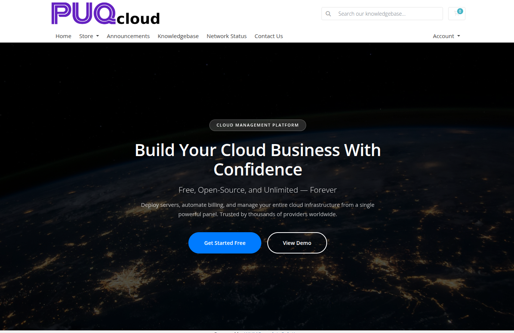

# Client Area Overview

### PUQ Page Manager module **[WHMCS](https://puqcloud.com/link.php?id=77)**
##### [Order now](https://puqcloud.com/whmcs-addon-puq-page-manager.php) | [Download](https://download.puqcloud.com/WHMCS/addons/PUQ_WHMCS-Page-Manager/) | [Community](https://community.puqcloud.com/)

This page describes the client area interface and actions available to active service clients.

## Accessing the Client Area
Pages are available via clean, search-engine-friendly URLs mapped by the administrator (e.g., `https://yourdomain.com/page-url-name/`).

## Client Actions
Within the control area, clients can:
- **View Custom Pages**: Access seamlessly integrated custom pages in the WHMCS frontend.
- **Unlock Password Protected Pages**: Clients will be prompted with a secure login card to unlock the content if a page is password protected.

## Visibility Settings
Pages can be restricted to specific user scopes:
1. **All Visitors**: Open to everyone.
2. **Guests Only**: Visible only to logged-out users.
3. **Clients Only**: Visible only to logged-in users.
4. **Client Groups**: Restricts access to members of specific client groups defined in WHMCS.

## Screenshot

*client-overview.png*

