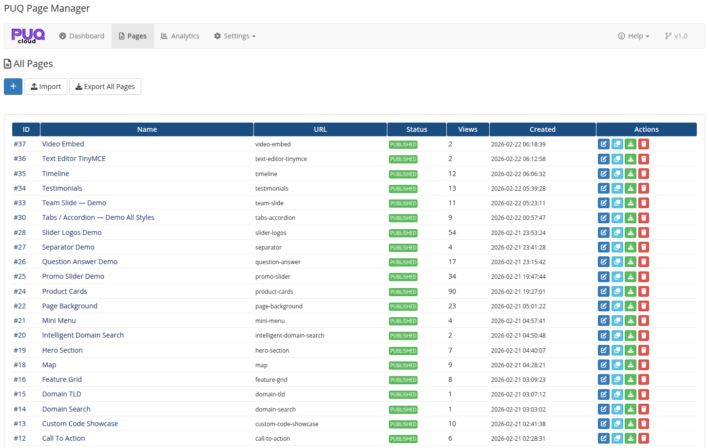

# Pages

### Page Manager addon **[WHMCS](https://puqcloud.com/link.php?id=77)**
#####  [Order now](https://puqcloud.com/store/whmcs-addon-modules) | [Download](https://download.puqcloud.com/WHMCS/addons/PUQ_WHMCS-Page-Manager/) | [FAQ](https://community.puqcloud.com/)

The Pages section allows you to view, create, edit, and manage all your custom pages.

*03-pages.png*

---

## All Pages

The pages list displays all created pages in a table with the following columns:

| Column | Description |
|--------|-------------|
| **ID** | Unique page identifier |
| **Name** | Page title |
| **URL** | The URL slug used to access the page |
| **Status** | Current status: Published, Draft, Scheduled, or Archived |
| **Views** | Total page view count |
| **Created** | Date and time when the page was created |
| **Actions** | Edit, view, duplicate, export, delete |

---

## Add New Page

Click the **Add Page** button at the top of the pages list. A new page is created instantly via AJAX and you are redirected to the page editor.

---

## Page Editor

Clicking **Edit** on any page opens the page editor. The editor is organized into collapsible panels:

### General Settings

| Field | Description |
|-------|-------------|
| **Name** | Page title displayed in the browser tab and page header |
| **URL** | URL slug for the page (e.g., `my-page` → `yourdomain.com/index.php?m=puq_page_manager&page=my-page`) |
| **Parent Page** | Optional parent page for hierarchical organization |
| **Sort Order** | Numeric value for sorting pages (lower = first) |
| **Status** | Draft, Published, Scheduled, or Archived |

### Visibility & Access

| Field | Description |
|-------|-------------|
| **Visibility** | Who can see the page: All Visitors, Guests Only, Clients Only, or Client Groups |
| **Required Login** | If enabled, visitors must log in to view the page |
| **Password Protection** | Protect the page with a password |

### Content

The block widget editor (EditorJS) is the main content area. You can add, arrange, and configure widgets by clicking the **+** button or using the toolbar. Each widget block can be moved up/down, duplicated, or deleted.

### SEO

| Field | Description |
|-------|-------------|
| **OG Title** | Open Graph title for social media sharing |
| **OG Description** | Open Graph description |
| **OG Image** | Open Graph image URL |
| **Keyword(s)** | Meta keywords |
| **Canonical URL** | Canonical URL for SEO |
| **Meta Robots** | Meta robots directive (index/noindex, follow/nofollow) |
| **Schema JSON-LD** | Structured data in JSON-LD format |
| **Custom CSS** | Custom CSS styles for this page only |
| **Custom JS** | Custom JavaScript for this page only |

### Languages

The Languages panel allows you to manage translations for the page. You can:
- Add translations for any language
- Copy content from another language
- Track translation status: **Translated**, **Needs Update**, **Not Translated**
- Delete translations

### Revisions

The Revisions panel shows the revision history for the page. Each revision stores a snapshot of the page content. You can:
- Preview the content of any revision
- Restore a previous revision with one click

---

## Import / Export

- **Export Page** — export a single page as a JSON file (available from the page actions menu)
- **Export All Pages** — export all pages as a single JSON file (available from the Settings page)
- **Import Page** — import a page from a JSON file (available from the Settings page)
