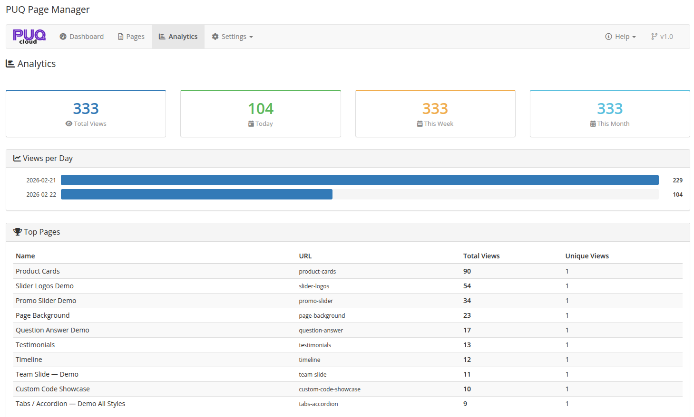

# Analytics

### Page Manager addon **[WHMCS](https://puqcloud.com/link.php?id=77)**
#####  [Order now](https://puqcloud.com/store/whmcs-addon-modules) | [Download](https://download.puqcloud.com/WHMCS/addons/PUQ_WHMCS-Page-Manager/) | [FAQ](https://community.puqcloud.com/)

The Analytics page provides insights into page views and visitor activity.

*04-analytics.png*

---

## Overview Cards

Four cards at the top display key metrics:

| Card | Description |
|------|-------------|
| **Total Views** | Total page views across all pages (all time) |
| **Today** | Page views recorded today |
| **This Week** | Page views for the current week |
| **This Month** | Page views for the current month |

---

## Views per Day

A horizontal bar chart showing the number of page views per day. Each bar represents one day with the exact view count displayed.

---

## Top Pages

A table listing the most popular pages, sorted by total views:

| Column | Description |
|--------|-------------|
| **Name** | Page title |
| **URL** | Page URL slug |
| **Total Views** | Total number of views |
| **Unique Views** | Number of unique visitors |
