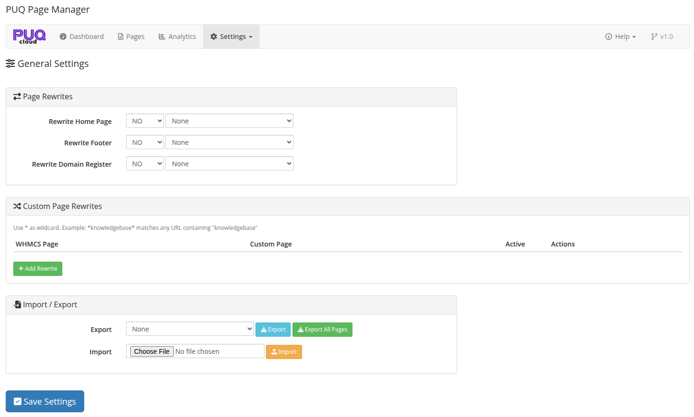
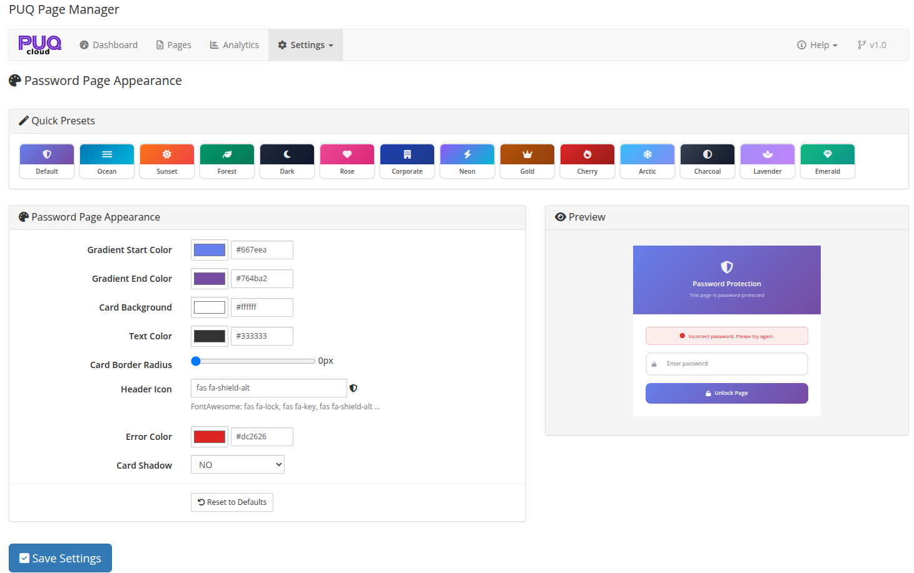

# Settings

### Page Manager addon **[WHMCS](https://puqcloud.com/link.php?id=77)**
#####  [Order now](https://puqcloud.com/store/whmcs-addon-modules) | [Download](https://download.puqcloud.com/WHMCS/addons/PUQ_WHMCS-Page-Manager/) | [FAQ](https://community.puqcloud.com/)

The Settings page allows you to configure page rewrites, import/export pages, and customize the password protection page appearance.

*05-settings.png*

---

## Page Rewrites

Page rewrites allow you to replace standard WHMCS pages with your custom pages.

### Built-in Rewrites

| Rewrite | Description |
|---------|-------------|
| **Rewrite Home Page** | Replace the WHMCS home page with a custom page |
| **Rewrite Footer** | Replace the WHMCS footer with a custom page |
| **Rewrite Domain Register** | Replace the domain registration page with a custom page |

Each rewrite has a YES/NO toggle and a page selector dropdown.

### Custom Page Rewrites

You can create custom rewrites to replace any WHMCS page URL with your custom page.

Click **+ Add Rewrite** to add a new rule. Each rule has:

| Field | Description |
|-------|-------------|
| **WHMCS Page** | The URL pattern to match (supports `*` wildcard) |
| **Custom Page** | The page to display instead |
| **Active** | Enable or disable the rewrite |

> **Note:** Use `*` as a wildcard. Example: `*knowledgebase*` matches any URL containing "knowledgebase".

---

## Import / Export

| Action | Description |
|--------|-------------|
| **Export** | Select a page from the dropdown and click "Export" to download it as a JSON file |
| **Export All Pages** | Export all pages as a single JSON archive |
| **Import** | Upload a JSON file to import a page |

---

## Password Page Appearance

Customize the look and feel of the password protection page that visitors see when accessing a password-protected page.

*06-settings-password-appearance.png*

### Quick Presets

Choose from built-in color presets to quickly style the password page: Default, Ocean, Sunset, Forest, Dark, Rose, Corporate, Neon, Gold, Cherry, Arctic, Charcoal, Lavender, Emerald.

### Customization Options

| Setting | Description |
|---------|-------------|
| **Gradient Start Color** | Start color of the background gradient |
| **Gradient End Color** | End color of the background gradient |
| **Card Background** | Background color of the password card |
| **Text Color** | Color of the text on the card |
| **Card Border Radius** | Corner rounding of the card (in pixels) |
| **Header Icon** | FontAwesome icon class displayed at the top of the card |
| **Error Color** | Color of the error message when an incorrect password is entered |
| **Card Shadow** | Enable or disable the card drop shadow |

A **live preview** on the right side of the settings shows how the password page will look in real time as you adjust the settings.

Click **Reset to Defaults** to restore the default appearance settings.
