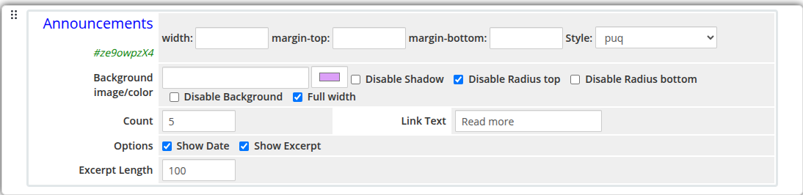
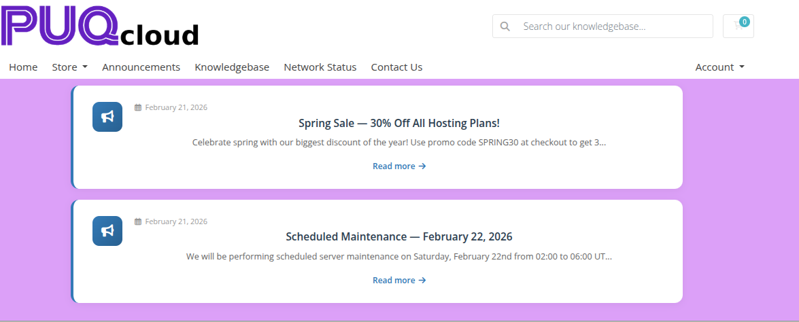

# Announcements

### Page Manager addon **[WHMCS](https://puqcloud.com/link.php?id=77)**
#####  [Order now](https://puqcloud.com/store/whmcs-addon-modules) | [Download](https://download.puqcloud.com/WHMCS/addons/PUQ_WHMCS-Page-Manager/) | [FAQ](https://community.puqcloud.com/)

The Announcements widget displays the latest announcements pulled directly from the WHMCS `tblannouncements` table. It renders a configurable list of announcement entries with optional dates, excerpts, and read-more links.

---

## Admin Settings

*announcements-admin.png*

---

## Frontend

*announcements-frontend.png*

---

## Settings

### Content Settings

| Setting | Type | Default | Description |
|---------|------|---------|-------------|
| **count** | number | `5` | Number of announcements to display |
| **show_date** | checkbox | off | Show the announcement publication date |
| **show_excerpt** | checkbox | off | Show a text excerpt below the announcement title |
| **excerpt_length** | number | `200` | Maximum number of characters for the excerpt |
| **link_text** | text | `Read more` | Label text for the link to the full announcement |

---

### Layout Settings

| Setting | Type | Default | Description |
|---------|------|---------|-------------|
| **width** | text | — | CSS width of the widget container (e.g. `800px`, `100%`) |
| **margin_top** | text | — | CSS top margin (e.g. `20px`) |
| **margin_bottom** | text | — | CSS bottom margin (e.g. `20px`) |
| **style** | select | `puq` | Visual style template |
| **background_image** | text | — | URL of the background image |
| **background_color** | color | `#FFFFFF` | Background color of the widget container |
| **disable_background_shadow** | checkbox | off | Remove the drop shadow from the container |
| **disable_background_radius_top** | checkbox | off | Remove the top border radius from the container |
| **disable_background_radius_bottom** | checkbox | off | Remove the bottom border radius from the container |
| **disable_background** | checkbox | off | Disable the background container entirely |
| **full_width** | checkbox | off | Stretch the widget to the full page width |

---

## Style Templates

| Template | Description |
|----------|-------------|
| `puq` | Default announcement list style |
