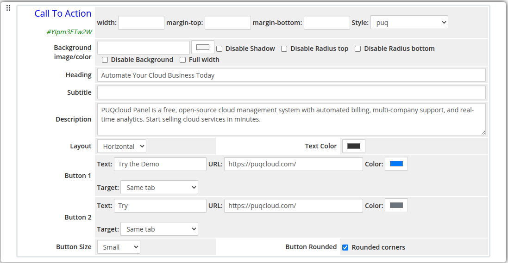
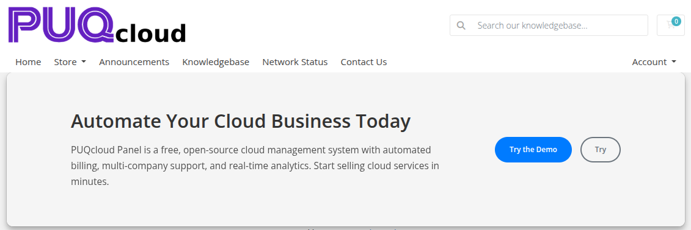

# Call To Action

### Page Manager addon **[WHMCS](https://puqcloud.com/link.php?id=77)**
#####  [Order now](https://puqcloud.com/store/whmcs-addon-modules) | [Download](https://download.puqcloud.com/WHMCS/addons/PUQ_WHMCS-Page-Manager/) | [FAQ](https://community.puqcloud.com/)

The Call To Action widget renders a prominent banner with a heading, subtitle, description, and up to two action buttons. It is designed to direct visitors toward a key conversion goal such as signing up, purchasing, or contacting support.

---

## Admin Settings

*call-to-action-admin.png*

---

## Frontend

*call-to-action-frontend.png*

---

## Settings

### Content Settings

| Setting | Type | Default | Description |
|---------|------|---------|-------------|
| **heading** | text | — | Main heading text |
| **subtitle** | text | — | Subtitle displayed below the heading |
| **description** | textarea | — | Longer descriptive text below the subtitle |
| **layout** | select | `center` | Content alignment: `center`, `left`, or `horizontal` |
| **text_color** | color | `#333333` | Color applied to all text content |

---

### Button 1

| Setting | Type | Default | Description |
|---------|------|---------|-------------|
| **button_text** | text | — | Label for the primary button |
| **button_url** | text | — | URL the primary button links to |
| **button_color** | color | `#337ab7` | Background color of the primary button |
| **button_target** | select | `_self` | Link target: `Same tab` or `New tab` |

---

### Button 2

| Setting | Type | Default | Description |
|---------|------|---------|-------------|
| **button2_text** | text | — | Label for the secondary button |
| **button2_url** | text | — | URL the secondary button links to |
| **button2_color** | color | `#6c757d` | Background color of the secondary button |
| **button2_target** | select | `_self` | Link target: `Same tab` or `New tab` |

---

### Button Options

| Setting | Type | Default | Description |
|---------|------|---------|-------------|
| **button_size** | select | `md` | Size of both buttons: `sm`, `md`, or `lg` |
| **button_rounded** | checkbox | off | Apply rounded corners to both buttons |

---

### Layout Settings

| Setting | Type | Default | Description |
|---------|------|---------|-------------|
| **width** | text | — | CSS width of the widget container (e.g. `800px`, `100%`) |
| **margin_top** | text | — | CSS top margin (e.g. `20px`) |
| **margin_bottom** | text | — | CSS bottom margin (e.g. `20px`) |
| **style** | select | `puq` | Visual style template |
| **background_image** | text | — | URL of the background image |
| **background_color** | color | `#FFFFFF` | Background color of the widget container |
| **disable_background_shadow** | checkbox | off | Remove the drop shadow from the container |
| **disable_background_radius_top** | checkbox | off | Remove the top border radius from the container |
| **disable_background_radius_bottom** | checkbox | off | Remove the bottom border radius from the container |
| **disable_background** | checkbox | off | Disable the background container entirely |
| **full_width** | checkbox | off | Stretch the widget to the full page width |

---

## Style Templates

| Template | Description |
|----------|-------------|
| `puq` | Default call-to-action style |
