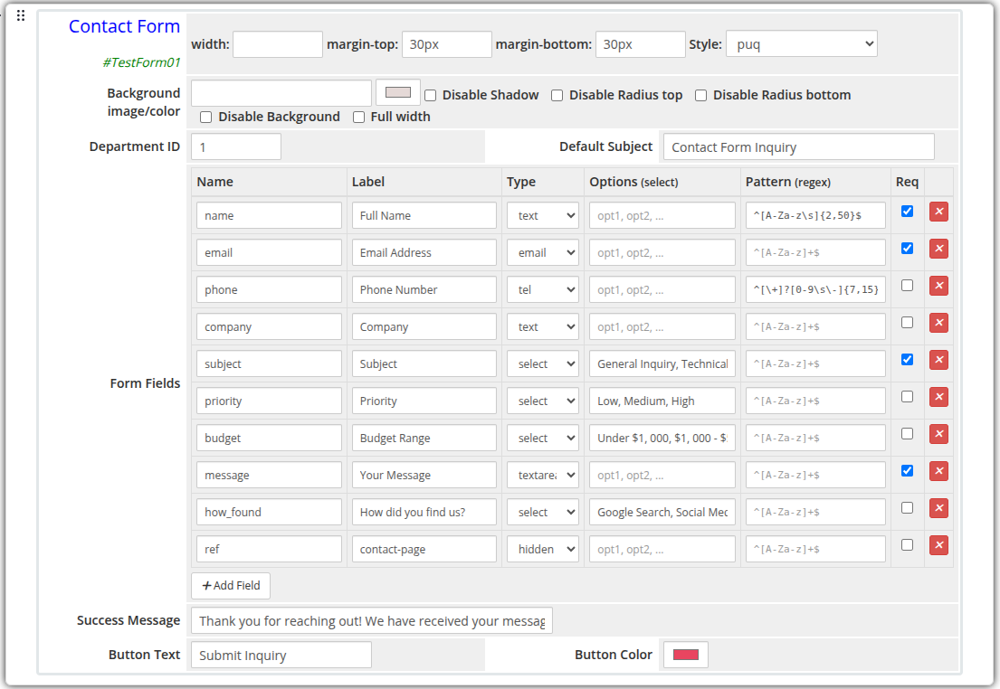
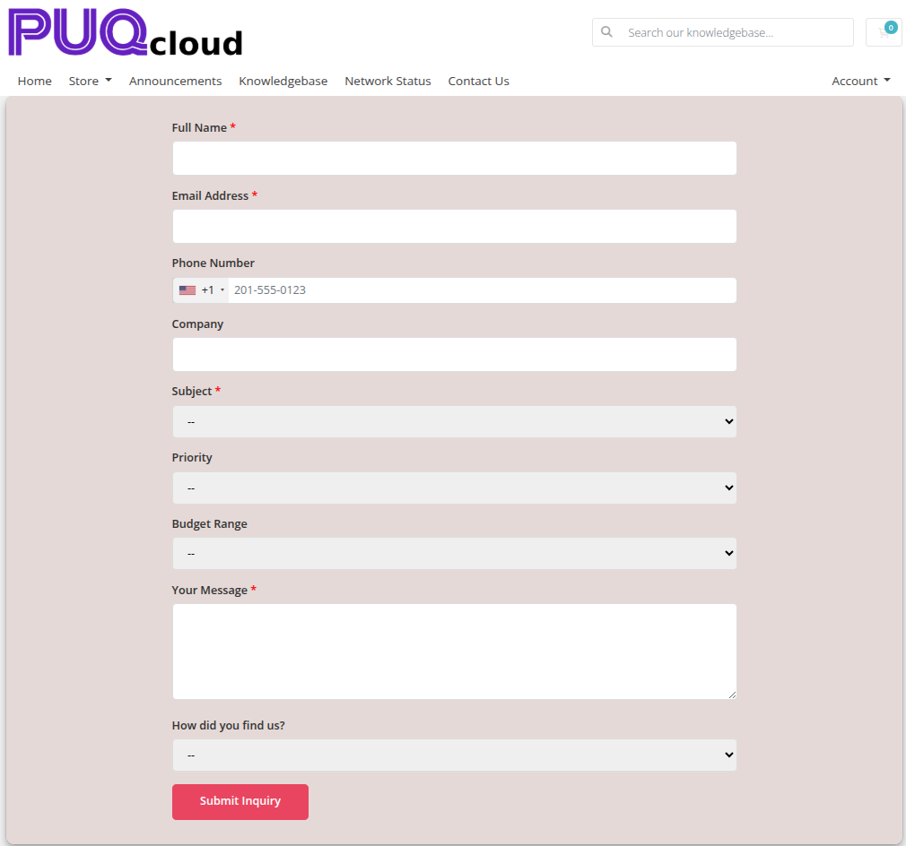

# Contact Form

### Page Manager addon **[WHMCS](https://puqcloud.com/link.php?id=77)**
#####  [Order now](https://puqcloud.com/store/whmcs-addon-modules) | [Download](https://download.puqcloud.com/WHMCS/addons/PUQ_WHMCS-Page-Manager/) | [FAQ](https://community.puqcloud.com/)

The Contact Form widget renders a fully customizable form that submits visitor messages directly to a WHMCS support department. Form fields are configurable with a visual editor supporting multiple input types, validation patterns, and required flags.

---

## Admin Settings

*contact-form-admin.png*

---

## Frontend

*contact-form-frontend.png*

---

## Settings

### Form Settings

| Setting | Type | Default | Description |
|---------|------|---------|-------------|
| **department_id** | text | — | WHMCS support department ID to receive submitted tickets |
| **subject_default** | text | — | Pre-filled subject line for the generated support ticket |
| **success_message** | text | `Thank you! Your message has been sent.` | Message shown to the visitor after a successful submission |
| **button_text** | text | `Send Message` | Label on the submit button |
| **button_color** | color | `#6420c0` | Background color of the submit button |

---

### Form Fields

Fields are defined with a visual row editor. Each row has the following columns:

| Column | Description |
|--------|-------------|
| **Name** | Internal field name (used as the form input `name` attribute) |
| **Label** | Human-readable label shown above the field |
| **Type** | Input type: `text`, `email`, `textarea`, `select`, `tel`, `number`, or `hidden` |
| **Options** | Comma-separated list of options for `select` type fields |
| **Pattern** | Optional regex validation pattern (e.g. `^[A-Za-z]+$`) |
| **Required** | Checkbox — marks the field as mandatory |

Default fields: `name` (text, required), `email` (email, required), `message` (textarea, required).

Fields can be added, removed, and reordered using the visual editor.

---

### Layout Settings

| Setting | Type | Default | Description |
|---------|------|---------|-------------|
| **width** | text | — | CSS width of the widget container (e.g. `800px`, `100%`) |
| **margin_top** | text | — | CSS top margin (e.g. `20px`) |
| **margin_bottom** | text | — | CSS bottom margin (e.g. `20px`) |
| **style** | select | `puq` | Visual style template |
| **background_image** | text | — | URL of the background image |
| **background_color** | color | `#FFFFFF` | Background color of the widget container |
| **disable_background_shadow** | checkbox | off | Remove the drop shadow from the container |
| **disable_background_radius_top** | checkbox | off | Remove the top border radius from the container |
| **disable_background_radius_bottom** | checkbox | off | Remove the bottom border radius from the container |
| **disable_background** | checkbox | off | Disable the background container entirely |
| **full_width** | checkbox | off | Stretch the widget to the full page width |

---

## Style Templates

| Template | Description |
|----------|-------------|
| `puq` | Default contact form style |
