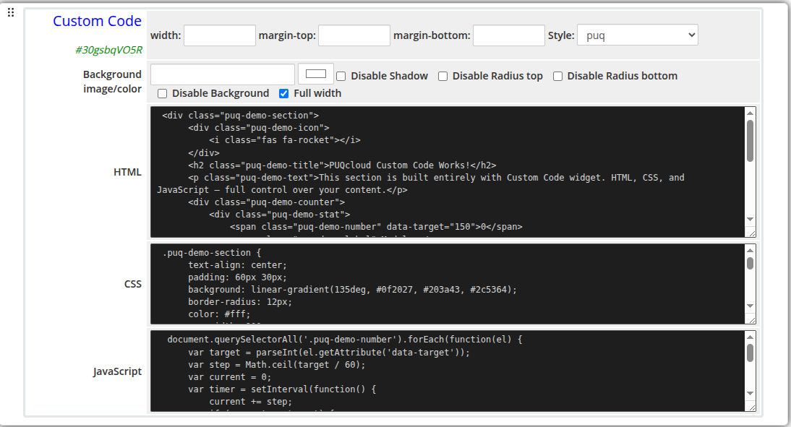
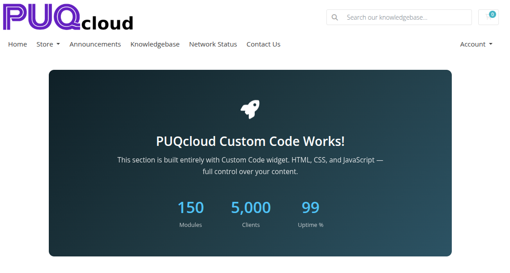

# Custom Code

### Page Manager addon **[WHMCS](https://puqcloud.com/link.php?id=77)**
#####  [Order now](https://puqcloud.com/store/whmcs-addon-modules) | [Download](https://download.puqcloud.com/WHMCS/addons/PUQ_WHMCS-Page-Manager/) | [FAQ](https://community.puqcloud.com/)

The Custom Code widget allows you to insert raw HTML, CSS, and JavaScript directly into any page. All three code fields are presented as dark-themed monospace editors. HTML and CSS are injected into the page output; JavaScript is executed after the page loads.

---

## Admin Settings

*custom-code-admin.png*

---

## Frontend

*custom-code-frontend.png*

---

## Settings

### Code Settings

| Setting | Type | Description |
|---------|------|-------------|
| **html** | textarea (dark editor) | Raw HTML markup to inject into the page |
| **css** | textarea (dark editor) | CSS rules applied to the page when this block is rendered |
| **js** | textarea (dark editor) | JavaScript executed after page load |

Code is stored base64-encoded internally to preserve special characters and formatting.

---

### Layout Settings

| Setting | Type | Default | Description |
|---------|------|---------|-------------|
| **width** | text | — | CSS width of the widget container (e.g. `800px`, `100%`) |
| **margin_top** | text | — | CSS top margin (e.g. `20px`) |
| **margin_bottom** | text | — | CSS bottom margin (e.g. `20px`) |
| **style** | select | `puq` | Visual style template |
| **background_image** | text | — | URL of the background image |
| **background_color** | color | `#FFFFFF` | Background color of the widget container |
| **disable_background_shadow** | checkbox | off | Remove the drop shadow from the container |
| **disable_background_radius_top** | checkbox | off | Remove the top border radius from the container |
| **disable_background_radius_bottom** | checkbox | off | Remove the bottom border radius from the container |
| **disable_background** | checkbox | off | Disable the background container entirely |
| **full_width** | checkbox | off | Stretch the widget to the full page width |

---

## Style Templates

| Template | Description |
|----------|-------------|
| `puq` | Default custom code container style |
