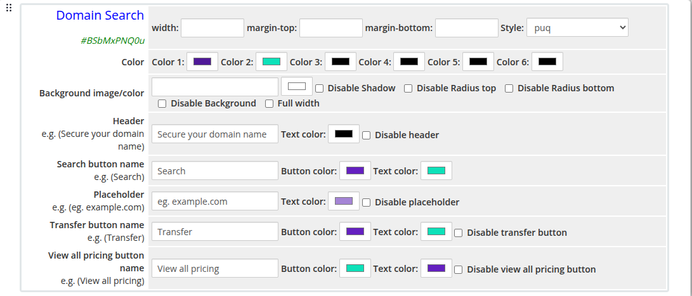
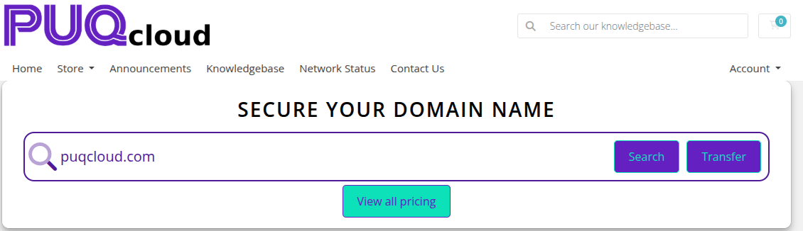

# Domain Search

### Page Manager addon **[WHMCS](https://puqcloud.com/link.php?id=77)**
#####  [Order now](https://puqcloud.com/store/whmcs-addon-modules) | [Download](https://download.puqcloud.com/WHMCS/addons/PUQ_WHMCS-Page-Manager/) | [FAQ](https://community.puqcloud.com/)

The Domain Search widget renders a domain search form using WHMCS domain functionality. Visitors can type a domain name, search for availability, initiate a domain transfer, or browse all pricing. All UI elements are fully color-customizable.

---

## Admin Settings

*domain-search-admin.png*

---

## Frontend

*domain-search-frontend.png*

---

## Settings

### Color Settings

| Setting | Type | Default | Description |
|---------|------|---------|-------------|
| **color_1** | color | `#4f1998` | Primary UI color (e.g. background gradient start) |
| **color_2** | color | `#0de1b9` | Secondary UI color (e.g. background gradient end) |
| **color_3** | color | `#000000` | Tertiary UI color |
| **color_4** | color | `#000000` | Quaternary UI color |
| **color_5** | color | `#000000` | Fifth UI color |
| **color_6** | color | `#000000` | Sixth UI color |

---

### Header

| Setting | Type | Default | Description |
|---------|------|---------|-------------|
| **header** | text | `Secure your domain name` | Heading text displayed above the search input |
| **header_text_color** | color | `#000000` | Color of the header text |
| **disable_header** | checkbox | off | Hide the header entirely |

---

### Search Button

| Setting | Type | Default | Description |
|---------|------|---------|-------------|
| **search_button_name** | text | `Search` | Label on the search button |
| **search_button_color** | color | `#6420c0` | Background color of the search button |
| **search_button_text_color** | color | `#0de1b9` | Text color of the search button |

---

### Input Placeholder

| Setting | Type | Default | Description |
|---------|------|---------|-------------|
| **placeholder** | text | `eg. example.com` | Placeholder text inside the domain input field |
| **placeholder_text_color** | color | `#a484d5` | Color of the placeholder text |
| **disable_placeholder** | checkbox | off | Hide the placeholder text |

---

### Transfer Button

| Setting | Type | Default | Description |
|---------|------|---------|-------------|
| **transfer_button_name** | text | `Transfer` | Label on the domain transfer button |
| **transfer_button_color** | color | `#6420c0` | Background color of the transfer button |
| **transfer_button_text_color** | color | `#0de1b9` | Text color of the transfer button |
| **disable_transfer_button** | checkbox | off | Hide the transfer button |

---

### View All Pricing Button

| Setting | Type | Default | Description |
|---------|------|---------|-------------|
| **view_all_pricing_button_name** | text | `View all pricing` | Label on the pricing button |
| **view_all_pricing_button_color** | color | `#0de1b9` | Background color of the pricing button |
| **view_all_pricing_button_text_color** | color | `#6420c0` | Text color of the pricing button |
| **disable_view_all_pricing_button** | checkbox | off | Hide the view all pricing button |

---

### Layout Settings

| Setting | Type | Default | Description |
|---------|------|---------|-------------|
| **width** | text | — | CSS width of the widget container (e.g. `800px`, `100%`) |
| **margin_top** | text | — | CSS top margin (e.g. `20px`) |
| **margin_bottom** | text | — | CSS bottom margin (e.g. `20px`) |
| **style** | select | `puq` | Visual style template |
| **background_image** | text | — | URL of the background image |
| **background_color** | color | `#FFFFFF` | Background color of the widget container |
| **disable_background_shadow** | checkbox | off | Remove the drop shadow from the container |
| **disable_background_radius_top** | checkbox | off | Remove the top border radius from the container |
| **disable_background_radius_bottom** | checkbox | off | Remove the bottom border radius from the container |
| **disable_background** | checkbox | off | Disable the background container entirely |
| **full_width** | checkbox | off | Stretch the widget to the full page width |

---

## Style Templates

| Template | Description |
|----------|-------------|
| `puq` | Default domain search style |
