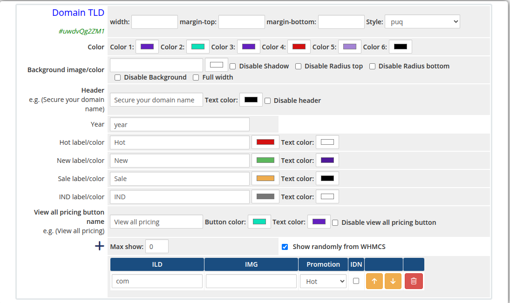
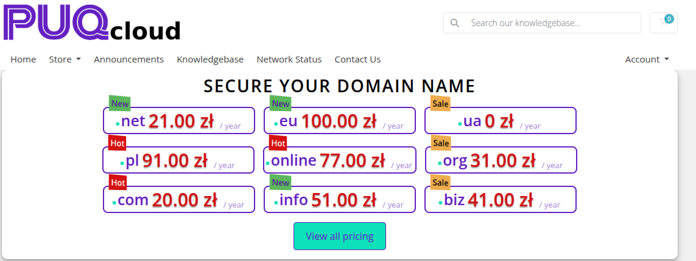

# Domain TLD

### Page Manager addon **[WHMCS](https://puqcloud.com/link.php?id=77)**
#####  [Order now](https://puqcloud.com/store/whmcs-addon-modules) | [Download](https://download.puqcloud.com/WHMCS/addons/PUQ_WHMCS-Page-Manager/) | [FAQ](https://community.puqcloud.com/)

The Domain TLD widget displays domain extension pricing fetched from the WHMCS `GetTLDPricing` API. TLD entries can be defined manually in the admin editor or pulled randomly from WHMCS. Each TLD supports a promotional label (Hot, New, Sale), an IDN flag, and a custom image.

---

## Admin Settings

*domain-tld-admin.png*

---

## Frontend

*domain-tld-frontend.png*

---

## Settings

### Display Settings

| Setting | Type | Default | Description |
|---------|------|---------|-------------|
| **max_show** | number | `0` | Maximum number of TLD entries to display (0 = show all) |
| **show_randomly_whmcs** | checkbox | off | Pull TLD pricing randomly from WHMCS instead of using the manual list |

---

### Header

| Setting | Type | Default | Description |
|---------|------|---------|-------------|
| **header** | text | `Secure your domain name` | Heading text above the TLD table |
| **header_text_color** | color | `#000000` | Color of the header text |
| **disable_header** | checkbox | off | Hide the header entirely |
| **year** | text | `year` | Label used for the pricing period (e.g. `year`, `/yr`) |

---

### Promotional Labels

| Setting | Type | Default | Description |
|---------|------|---------|-------------|
| **hot_label** | text | `Hot` | Text shown on the Hot badge |
| **hot_color** | color | `#d51111` | Background color of the Hot badge |
| **hot_text_color** | color | `#ffffff` | Text color of the Hot badge |
| **new_label** | text | `New` | Text shown on the New badge |
| **new_color** | color | `#5cb75c` | Background color of the New badge |
| **new_text_color** | color | `#4f1998` | Text color of the New badge |
| **sale_label** | text | `Sale` | Text shown on the Sale badge |
| **sale_color** | color | `#eeac4e` | Background color of the Sale badge |
| **sale_text_color** | color | `#000000` | Text color of the Sale badge |
| **idn_label** | text | `IND` | Text shown on the IDN badge |
| **idn_color** | color | `#767676` | Background color of the IDN badge |
| **idn_text_color** | color | `#fdfdfd` | Text color of the IDN badge |

---

### View All Pricing Button

| Setting | Type | Default | Description |
|---------|------|---------|-------------|
| **view_all_pricing_button_name** | text | `View all pricing` | Label on the pricing button |
| **view_all_pricing_button_color** | color | `#0de1b9` | Background color of the pricing button |
| **view_all_pricing_button_text_color** | color | `#6420c0` | Text color of the pricing button |
| **disable_view_all_pricing_button** | checkbox | off | Hide the view all pricing button |

---

### Color Settings

| Setting | Type | Default | Description |
|---------|------|---------|-------------|
| **color_1** | color | `#6420c0` | Primary UI color |
| **color_2** | color | `#0de1b9` | Secondary UI color |
| **color_3** | color | `#6420c0` | Tertiary UI color |
| **color_4** | color | `#d41111` | Quaternary UI color |
| **color_5** | color | `#a484d5` | Fifth UI color |
| **color_6** | color | `#000000` | Sixth UI color |

---

### TLD Entries

TLD entries are managed with a visual table editor. Each row defines one TLD:

| Column | Description |
|--------|-------------|
| **TLD** | The domain extension (e.g. `.com`, `.net`) |
| **IMG** | URL of a logo or flag image for the TLD |
| **Promotion** | Badge to display: none, `Hot`, `New`, or `Sale` |
| **IDN** | Checkbox — marks the TLD as IDN-supported |

Rows can be added, removed, and reordered using the arrow buttons.

---

### Layout Settings

| Setting | Type | Default | Description |
|---------|------|---------|-------------|
| **width** | text | — | CSS width of the widget container (e.g. `800px`, `100%`) |
| **margin_top** | text | — | CSS top margin (e.g. `20px`) |
| **margin_bottom** | text | — | CSS bottom margin (e.g. `20px`) |
| **style** | select | `puq` | Visual style template |
| **background_image** | text | — | URL of the background image |
| **background_color** | color | `#FFFFFF` | Background color of the widget container |
| **disable_background_shadow** | checkbox | off | Remove the drop shadow from the container |
| **disable_background_radius_top** | checkbox | off | Remove the top border radius from the container |
| **disable_background_radius_bottom** | checkbox | off | Remove the bottom border radius from the container |
| **disable_background** | checkbox | off | Disable the background container entirely |
| **full_width** | checkbox | off | Stretch the widget to the full page width |

---

## Style Templates

| Template | Description |
|----------|-------------|
| `puq` | Default domain TLD pricing table style |
