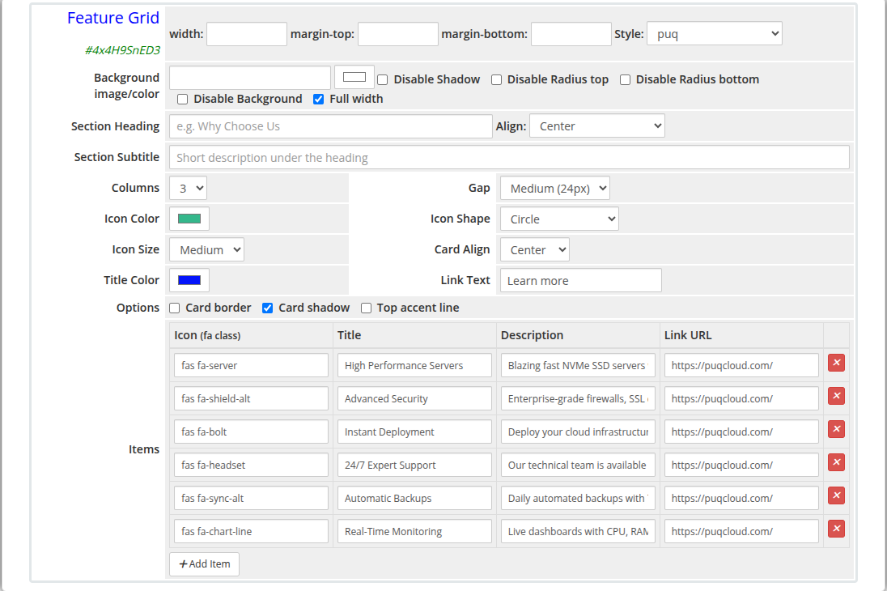

# Feature Grid

### Page Manager addon **[WHMCS](https://puqcloud.com/link.php?id=77)**
#####  [Order now](https://puqcloud.com/store/whmcs-addon-modules) | [Download](https://download.puqcloud.com/WHMCS/addons/PUQ_WHMCS-Page-Manager/) | [FAQ](https://community.puqcloud.com/)

The Feature Grid widget renders a responsive grid of feature cards. Each card displays a Font Awesome icon, a title, a description, and an optional link. The grid layout, icon appearance, card alignment, and visual options are all configurable.

---

## Admin Settings

*feature-grid-admin.png*

---

## Frontend

*feature-grid-frontend.png*

---

## Settings

### Section Header

| Setting | Type | Default | Description |
|---------|------|---------|-------------|
| **heading** | text | — | Section heading displayed above the grid (e.g. `Why Choose Us`) |
| **heading_align** | select | `center` | Alignment of the heading: `center`, `left`, or `right` |
| **subtitle** | text | — | Short description displayed beneath the heading |

---

### Grid Layout

| Setting | Type | Default | Description |
|---------|------|---------|-------------|
| **columns** | select | `3` | Number of columns: `2`, `3`, or `4` |
| **gap** | select | `24` | Spacing between cards: `16` (Small), `24` (Medium), or `32` (Large) pixels |

---

### Icon Settings

| Setting | Type | Default | Description |
|---------|------|---------|-------------|
| **icon_color** | color | `#337ab7` | Color applied to all feature icons |
| **icon_shape** | select | `rounded` | Icon background shape: `rounded` (rounded square), `circle`, or `none` (no background) |
| **icon_size** | select | `md` | Icon size: `sm` (Small), `md` (Medium), or `lg` (Large) |

---

### Card Settings

| Setting | Type | Default | Description |
|---------|------|---------|-------------|
| **card_align** | select | `center` | Content alignment inside each card: `center` or `left` |
| **title_color** | color | `#2c3e50` | Color of the card title text |
| **link_text** | text | `Learn more` | Label for the optional card link |
| **show_border** | checkbox | off | Add a border around each card |
| **show_shadow** | checkbox | on | Add a drop shadow to each card |
| **show_accent** | checkbox | off | Add a colored accent line at the top of each card |

---

### Feature Items

Items are managed with a visual row editor. Each row defines one feature card:

| Column | Description |
|--------|-------------|
| **Icon** | Font Awesome class for the icon (e.g. `fas fa-server`, `fas fa-shield-alt`) |
| **Title** | Feature card heading text |
| **Description** | Short description text inside the card |
| **Link URL** | Optional URL the card title or link text points to |

Items can be added and removed using the editor controls.

---

### Layout Settings

| Setting | Type | Default | Description |
|---------|------|---------|-------------|
| **width** | text | — | CSS width of the widget container (e.g. `800px`, `100%`) |
| **margin_top** | text | — | CSS top margin (e.g. `20px`) |
| **margin_bottom** | text | — | CSS bottom margin (e.g. `20px`) |
| **style** | select | `puq` | Visual style template |
| **background_image** | text | — | URL of the background image |
| **background_color** | color | `#FFFFFF` | Background color of the widget container |
| **disable_background_shadow** | checkbox | off | Remove the drop shadow from the container |
| **disable_background_radius_top** | checkbox | off | Remove the top border radius from the container |
| **disable_background_radius_bottom** | checkbox | off | Remove the bottom border radius from the container |
| **disable_background** | checkbox | off | Disable the background container entirely |
| **full_width** | checkbox | off | Stretch the widget to the full page width |

---

## Style Templates

| Template | Description |
|----------|-------------|
| `puq` | Default feature grid style |
