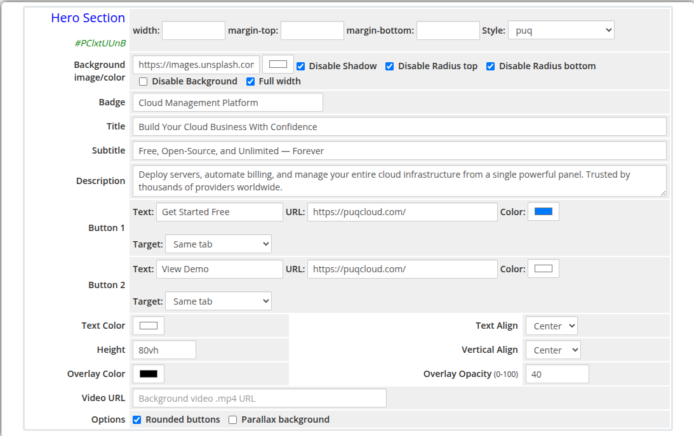

# Hero Section

### Page Manager addon **[WHMCS](https://puqcloud.com/link.php?id=77)**
#####  [Order now](https://puqcloud.com/store/whmcs-addon-modules) | [Download](https://download.puqcloud.com/WHMCS/addons/PUQ_WHMCS-Page-Manager/) | [FAQ](https://community.puqcloud.com/)

The Hero Section widget renders a full-width banner intended for the top of a page. It supports a badge tag, title, subtitle, description, two action buttons, overlay effects, a background video, and parallax scrolling. All typography, layout, and background options are configurable.

---

## Admin Settings

*hero-section-admin.png*

---

## Frontend

*hero-section-frontend.png*

---

## Settings

### Content Settings

| Setting | Type | Default | Description |
|---------|------|---------|-------------|
| **badge** | text | — | Small tag displayed above the title (e.g. `New Release`, `Special Offer`) |
| **title** | text | — | Main hero heading |
| **subtitle** | text | — | Secondary line of text below the title |
| **description** | textarea | — | Longer descriptive paragraph below the subtitle |

---

### Button 1

| Setting | Type | Default | Description |
|---------|------|---------|-------------|
| **button_text** | text | — | Label for the primary button |
| **button_url** | text | — | URL the primary button links to |
| **button_color** | color | `#337ab7` | Background color of the primary button |
| **button_target** | select | `_self` | Link target: `Same tab` or `New tab` |

---

### Button 2

| Setting | Type | Default | Description |
|---------|------|---------|-------------|
| **button2_text** | text | — | Label for the secondary button |
| **button2_url** | text | — | URL the secondary button links to |
| **button2_color** | color | `#ffffff` | Background color of the secondary button |
| **button2_target** | select | `_self` | Link target: `Same tab` or `New tab` |

---

### Typography and Alignment

| Setting | Type | Default | Description |
|---------|------|---------|-------------|
| **text_color** | color | `#ffffff` | Color applied to all text content in the hero |
| **text_align** | select | `center` | Horizontal alignment of content: `center`, `left`, or `right` |
| **vertical_align** | select | `center` | Vertical alignment of content: `center`, `top`, or `bottom` |

---

### Dimensions and Overlay

| Setting | Type | Default | Description |
|---------|------|---------|-------------|
| **height** | text | `80vh` | CSS height of the hero section (e.g. `80vh`, `600px`) |
| **overlay_color** | color | `#000000` | Color of the semi-transparent overlay on top of the background |
| **overlay_opacity** | number | `40` | Opacity of the overlay (0 = fully transparent, 100 = fully opaque) |
| **video_url** | text | — | URL of a `.mp4` video file to use as the background |

---

### Button Options

| Setting | Type | Default | Description |
|---------|------|---------|-------------|
| **button_rounded** | checkbox | on | Apply rounded corners to both buttons |
| **parallax** | checkbox | off | Enable parallax scrolling effect on the background image |

---

### Layout Settings

| Setting | Type | Default | Description |
|---------|------|---------|-------------|
| **width** | text | — | CSS width of the widget container (e.g. `800px`, `100%`) |
| **margin_top** | text | — | CSS top margin (e.g. `20px`) |
| **margin_bottom** | text | — | CSS bottom margin (e.g. `20px`) |
| **style** | select | `puq` | Visual style template |
| **background_image** | text | — | URL of the hero background image |
| **background_color** | color | `#1a1a2e` | Fallback background color when no image is set |
| **disable_background_shadow** | checkbox | off | Remove the drop shadow from the container |
| **disable_background_radius_top** | checkbox | off | Remove the top border radius from the container |
| **disable_background_radius_bottom** | checkbox | off | Remove the bottom border radius from the container |
| **disable_background** | checkbox | off | Disable the background container entirely |
| **full_width** | checkbox | off | Stretch the widget to the full page width |

---

## Style Templates

| Template | Description |
|----------|-------------|
| `puq` | Default hero section style |
