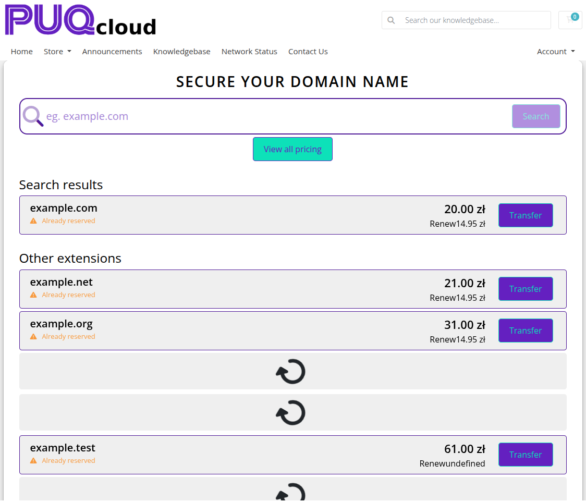
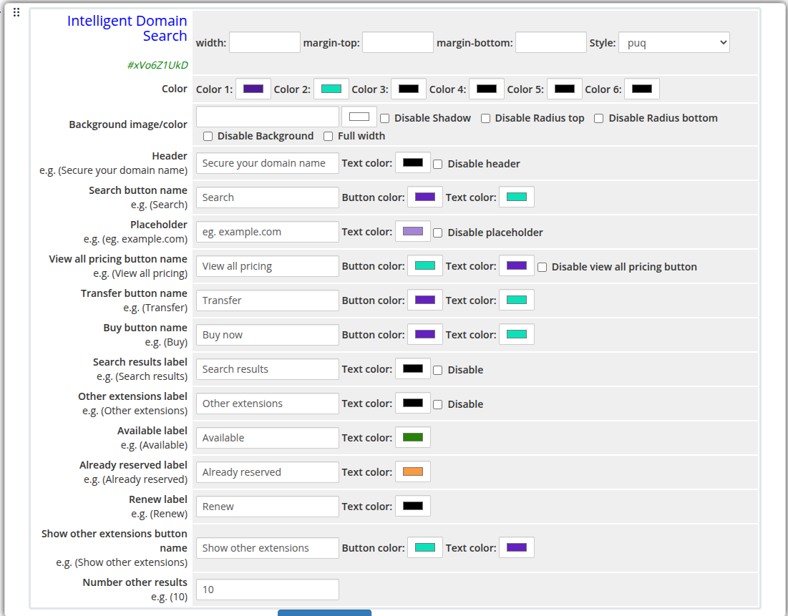

# Intelligent Domain Search

### Page Manager addon **[WHMCS](https://puqcloud.com/link.php?id=77)**
#####  [Order now](https://puqcloud.com/store/whmcs-addon-modules) | [Download](https://download.puqcloud.com/WHMCS/addons/PUQ_WHMCS-Page-Manager/) | [FAQ](https://community.puqcloud.com/)

The Intelligent Domain Search widget provides an advanced domain search experience that displays TLD availability, pricing, and buy/transfer actions directly on the page. It pulls live TLD data from WHMCS and presents results in a structured results panel with per-extension availability status and pricing.

---

## Admin View

*intelligent-domain-search-admin.png*

---

## Frontend View

*intelligent-domain-search-frontend.png*

---

## Settings

### Layout

| Setting | Description |
|---------|-------------|
| **width** | Widget container width (e.g. `100%`, `800px`) |
| **margin-top** | Top margin of the widget block |
| **margin-bottom** | Bottom margin of the widget block |
| **Style** | Visual style template (1 style available: `puq`) |

### Colors

| Setting | Description |
|---------|-------------|
| **Color 1** | Primary accent color |
| **Color 2** | Secondary accent color |
| **Color 3** | Color 3 |
| **Color 4** | Color 4 |
| **Color 5** | Color 5 |
| **Color 6** | Color 6 |

### Background

| Setting | Description |
|---------|-------------|
| **Background image** | URL of the background image for the widget container |
| **Background color** | Background color of the widget container |
| **Disable Shadow** | Remove the drop shadow from the widget container |
| **Disable Radius top** | Remove top corner rounding |
| **Disable Radius bottom** | Remove bottom corner rounding |
| **Disable Background** | Remove the background panel entirely |
| **Full width** | Stretch the widget to the full page width |

### Header

| Setting | Description |
|---------|-------------|
| **Header** | Heading text displayed above the search bar (e.g. `Secure your domain name`) |
| **Text color** | Color of the header text |
| **Disable header** | Hide the header text |

### Search Button

| Setting | Description |
|---------|-------------|
| **Search button name** | Label for the search action button (e.g. `Search`) |
| **Button color** | Background color of the search button |
| **Text color** | Text color of the search button |

### Placeholder

| Setting | Description |
|---------|-------------|
| **Placeholder** | Placeholder text inside the search input (e.g. `eg. example.com`) |
| **Text color** | Color of the placeholder text |
| **Disable placeholder** | Hide the placeholder text |

### View All Pricing Button

| Setting | Description |
|---------|-------------|
| **View all pricing button name** | Label for the pricing link button (e.g. `View all pricing`) |
| **Button color** | Background color of the button |
| **Text color** | Text color of the button |
| **Disable view all pricing button** | Hide the view all pricing button |

### Transfer Button

| Setting | Description |
|---------|-------------|
| **Transfer button name** | Label for the transfer action (e.g. `Transfer`) |
| **Button color** | Background color of the transfer button |
| **Text color** | Text color of the transfer button |

### Buy Button

| Setting | Description |
|---------|-------------|
| **Buy button name** | Label for the buy/add to cart action (e.g. `Buy`) |
| **Button color** | Background color of the buy button |
| **Text color** | Text color of the buy button |

### Result Labels

| Setting | Description |
|---------|-------------|
| **Search results label** | Section heading for primary results (e.g. `Search results`) |
| **Search results text color** | Color of the search results label |
| **Disable search results** | Hide the search results label |
| **Other extensions label** | Section heading for additional TLD results (e.g. `Other extensions`) |
| **Other extensions text color** | Color of the other extensions label |
| **Disable other extensions** | Hide the other extensions section |
| **Available label** | Status label for available domains (e.g. `Available`) |
| **Available text color** | Color of the available status label |
| **Already reserved label** | Status label for taken domains (e.g. `Already reserved`) |
| **Already reserved text color** | Color of the reserved status label |
| **Renew label** | Label used for renewal actions (e.g. `Renew`) |
| **Renew text color** | Color of the renew label |

### Other Extensions Button

| Setting | Description |
|---------|-------------|
| **Show other extensions button name** | Label for the expand button (e.g. `Show other extensions`) |
| **Button color** | Background color of the expand button |
| **Text color** | Text color of the expand button |
| **Number other results** | Number of additional TLD results to show (e.g. `10`) |
