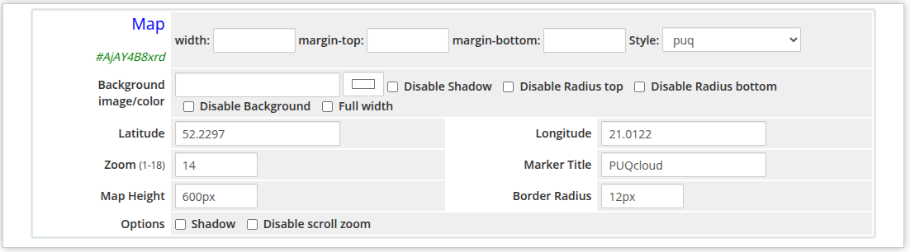
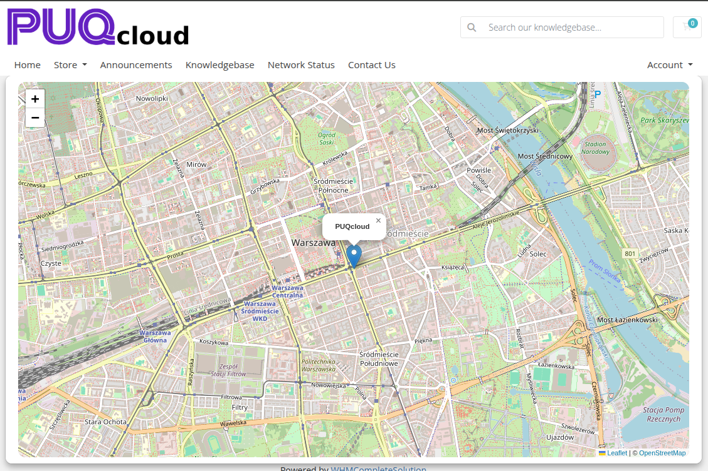

# Map

### Page Manager addon **[WHMCS](https://puqcloud.com/link.php?id=77)**
#####  [Order now](https://puqcloud.com/store/whmcs-addon-modules) | [Download](https://download.puqcloud.com/WHMCS/addons/PUQ_WHMCS-Page-Manager/) | [FAQ](https://community.puqcloud.com/)

The Map widget embeds an interactive OpenStreetMap into the page. You can set the geographic coordinates, zoom level, a marker title, and control the appearance of the map container. The map supports scroll-zoom toggle and an optional drop shadow.

---

## Admin View

*map-admin.png*

---

## Frontend View

*map-frontend.png*

---

## Settings

### Layout

| Setting | Description |
|---------|-------------|
| **width** | Widget container width (e.g. `100%`, `800px`) |
| **margin-top** | Top margin of the widget block |
| **margin-bottom** | Bottom margin of the widget block |
| **Style** | Visual style template (1 style available: `puq`) |

### Background

| Setting | Description |
|---------|-------------|
| **Background image** | URL of the background image for the widget container |
| **Background color** | Background color of the widget container |
| **Disable Shadow** | Remove the drop shadow from the widget container |
| **Disable Radius top** | Remove top corner rounding |
| **Disable Radius bottom** | Remove bottom corner rounding |
| **Disable Background** | Remove the background panel entirely |
| **Full width** | Stretch the widget to the full page width |

### Map

| Setting | Description |
|---------|-------------|
| **Latitude** | Geographic latitude of the map center (e.g. `52.2297`) |
| **Longitude** | Geographic longitude of the map center (e.g. `21.0122`) |
| **Zoom** | Initial zoom level, from 1 (world) to 18 (street level); default is `14` |
| **Marker Title** | Tooltip text shown when hovering over the map marker |
| **Map Height** | Height of the map iframe (e.g. `400px`) |
| **Border Radius** | Corner rounding of the map container (e.g. `12px`) |

### Options

| Setting | Description |
|---------|-------------|
| **Shadow** | Add a drop shadow beneath the map |
| **Disable scroll zoom** | Prevent the map from zooming when the user scrolls over it |
