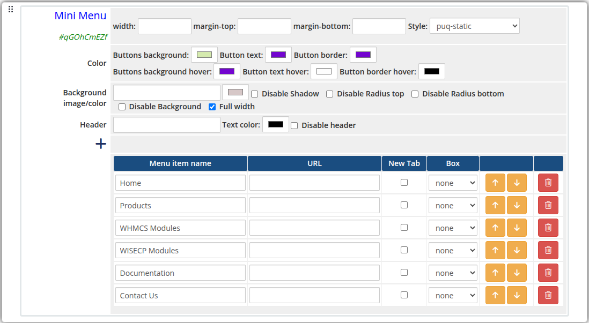
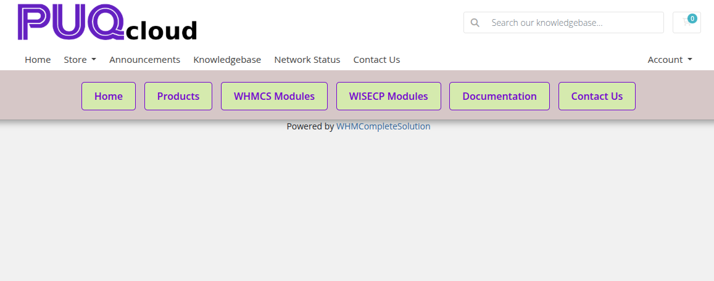

# Mini Menu

### Page Manager addon **[WHMCS](https://puqcloud.com/link.php?id=77)**
#####  [Order now](https://puqcloud.com/store/whmcs-addon-modules) | [Download](https://download.puqcloud.com/WHMCS/addons/PUQ_WHMCS-Page-Manager/) | [FAQ](https://community.puqcloud.com/)

The Mini Menu widget renders a compact horizontal navigation menu strip. Each item can link to any URL with optional new-tab opening and box-style display. Three style variants are available: a default inline strip, a bottom-anchored bar, and a static positioned menu.

---

## Admin View

*mini-menu-admin.png*

---

## Frontend View

*mini-menu-frontend.png*

---

## Styles

3 style templates are available: `puq` (default), `puq-bottom`, `puq-static`.

---

## Settings

### Layout

| Setting | Description |
|---------|-------------|
| **width** | Widget container width (e.g. `100%`, `800px`) |
| **margin-top** | Top margin of the widget block |
| **margin-bottom** | Bottom margin of the widget block |
| **Style** | Visual style template (`puq`, `puq-bottom`, `puq-static`) |

### Colors

| Setting | Description |
|---------|-------------|
| **Buttons background** (`color_1`) | Background color of the menu buttons |
| **Button text** (`color_2`) | Text color of the menu buttons |
| **Button border** (`color_3`) | Border color of the menu buttons |
| **Buttons background hover** (`color_4`) | Background color on hover |
| **Button text hover** (`color_5`) | Text color on hover |
| **Button border hover** (`color_6`) | Border color on hover |

### Background

| Setting | Description |
|---------|-------------|
| **Background image** | URL of the background image for the widget container |
| **Background color** | Background color of the widget container |
| **Disable Shadow** | Remove the drop shadow from the widget container |
| **Disable Radius top** | Remove top corner rounding |
| **Disable Radius bottom** | Remove bottom corner rounding |
| **Disable Background** | Remove the background panel entirely |
| **Full width** | Stretch the widget to the full page width |

### Header

| Setting | Description |
|---------|-------------|
| **Header** | Optional heading text displayed above the menu |
| **Text color** | Color of the header text |
| **Disable header** | Hide the header text |

### Menu Items

Each menu item row contains the following fields:

| Field | Description |
|-------|-------------|
| **Menu item name** | Display label for the navigation link |
| **URL** | Destination URL for the link |
| **New Tab** | Open the link in a new browser tab when checked |
| **Box** | Display style variant for the individual button |

Use the **+** button to add new menu items. Items can be reordered with the up/down arrows and removed with the delete button.
