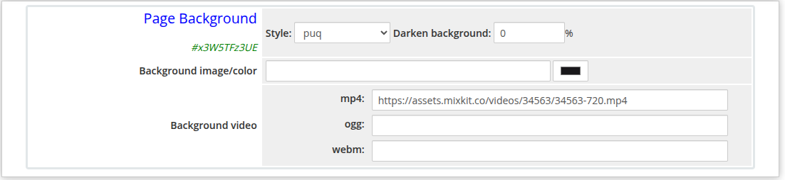
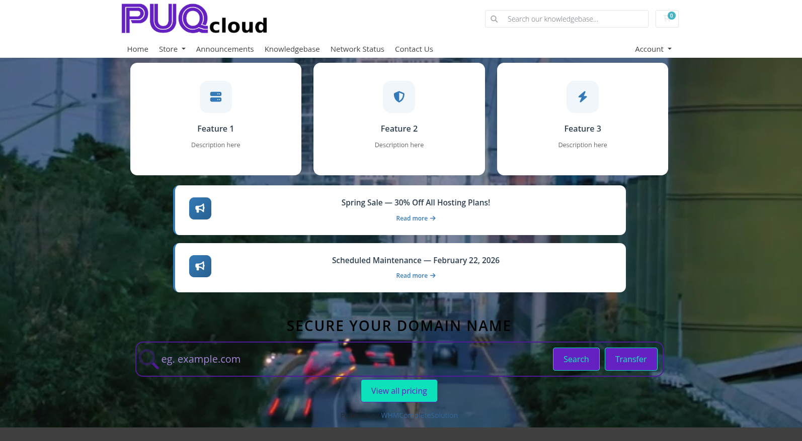

# Page Background

### Page Manager addon **[WHMCS](https://puqcloud.com/link.php?id=77)**
#####  [Order now](https://puqcloud.com/store/whmcs-addon-modules) | [Download](https://download.puqcloud.com/WHMCS/addons/PUQ_WHMCS-Page-Manager/) | [FAQ](https://community.puqcloud.com/)

The Page Background widget sets the background for the entire page. Unlike content widgets, it does not render a visible block in the page flow — instead it applies a full-page background using an image, a solid color, or a looping video. Only one Page Background widget should be placed per page.

---

## Admin View

*page-background-admin.png*

---

## Frontend View

*page-background-frontend.png*

---

## Settings

| Setting | Description |
|---------|-------------|
| **Style** | Template variant (1 style available: `puq`) |
| **Darken background** | Overlay opacity applied on top of the background image or video (0–99%) |
| **Background image** | URL of the background image |
| **Background color** | Fallback solid color when no image or video is set |
| **Background video (mp4)** | URL to the `.mp4` video file for a looping background video |
| **Background video (ogg)** | URL to the `.ogg` video file (fallback for browsers that do not support mp4) |
| **Background video (webm)** | URL to the `.webm` video file (fallback for browsers that do not support mp4) |
