# Product Cards

### Page Manager addon **[WHMCS](https://puqcloud.com/link.php?id=77)**
#####  [Order now](https://puqcloud.com/store/whmcs-addon-modules) | [Download](https://download.puqcloud.com/WHMCS/addons/PUQ_WHMCS-Page-Manager/) | [FAQ](https://community.puqcloud.com/)

The Product Cards widget displays WHMCS products with their pricing and descriptions in a card layout. Products can be loaded automatically from a WHMCS product group or added manually. Each card supports hot/new/sale badge overlays and an Order Now button. Ten visual styles are available.

---

## Admin View

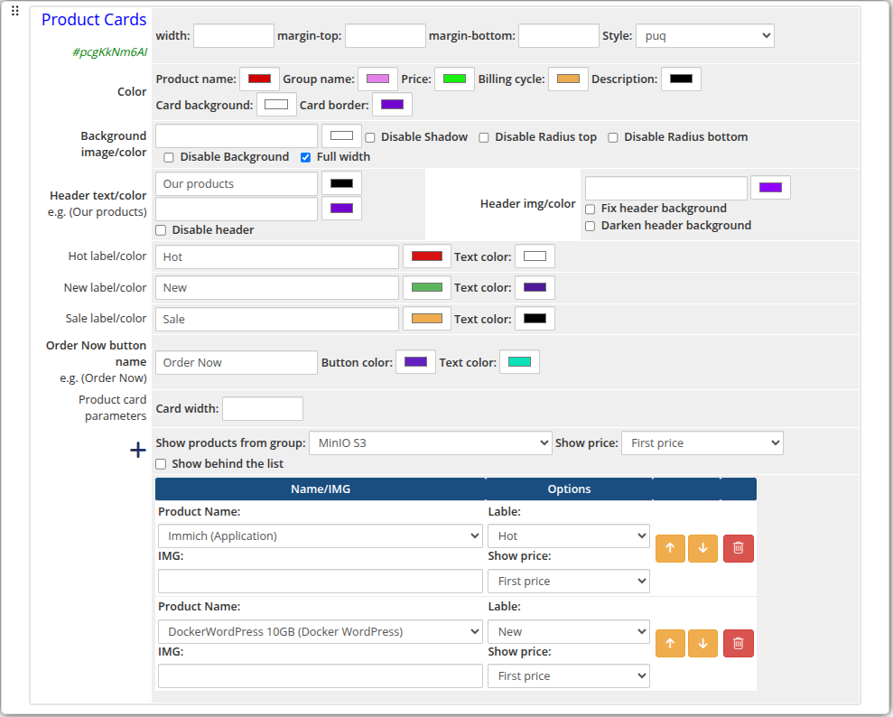
*product-cards-01-admin.png*

---

## Frontend Styles

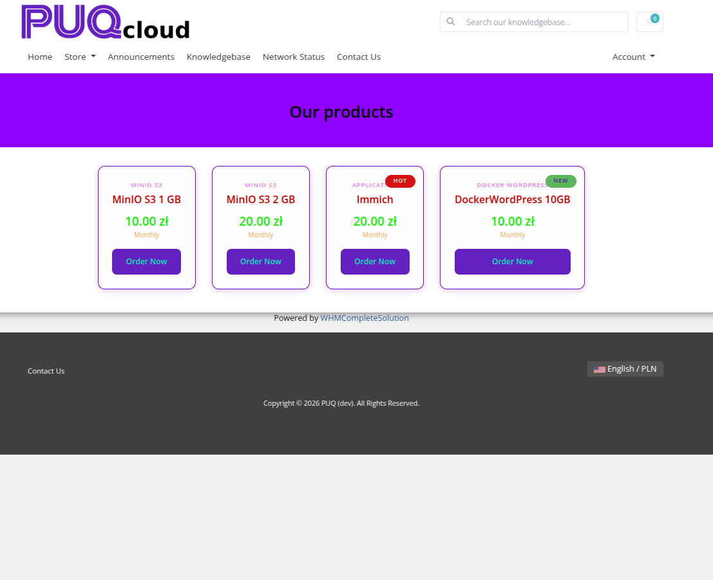
*product-cards-02-style-default.png*

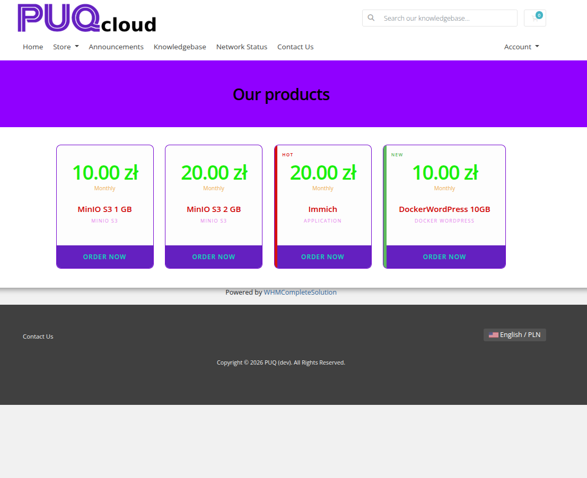
*product-cards-03-style-bold.png*

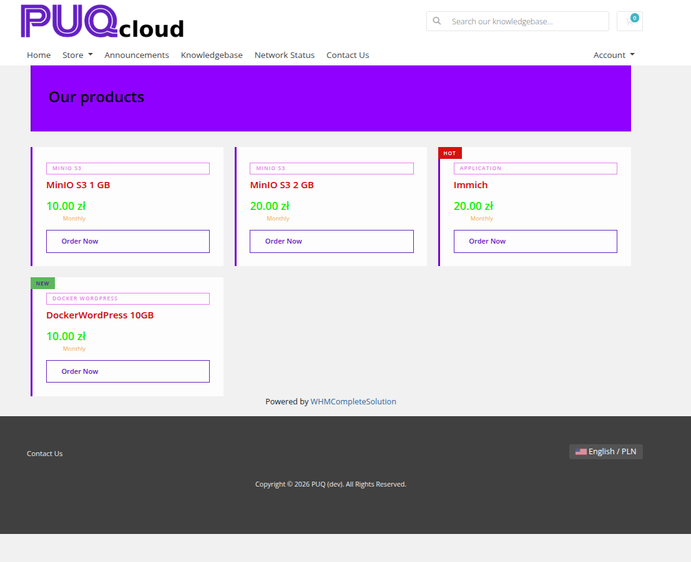
*product-cards-04-style-border.png*

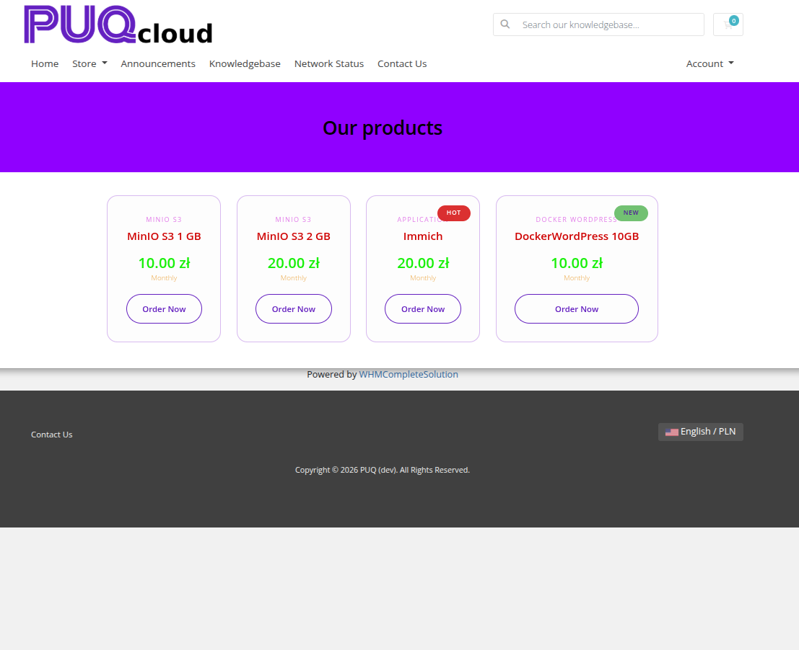
*product-cards-05-style-glass.png*

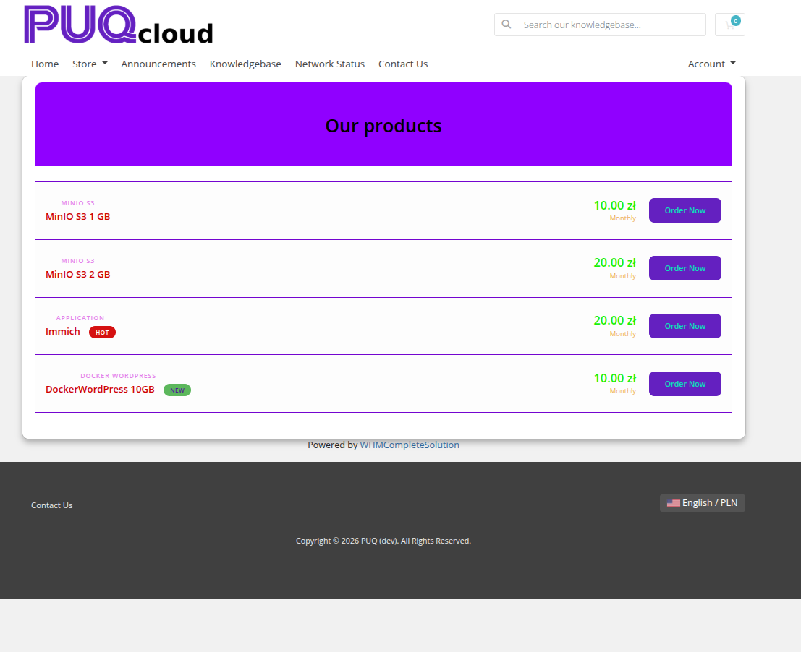
*product-cards-06-style-list.png*

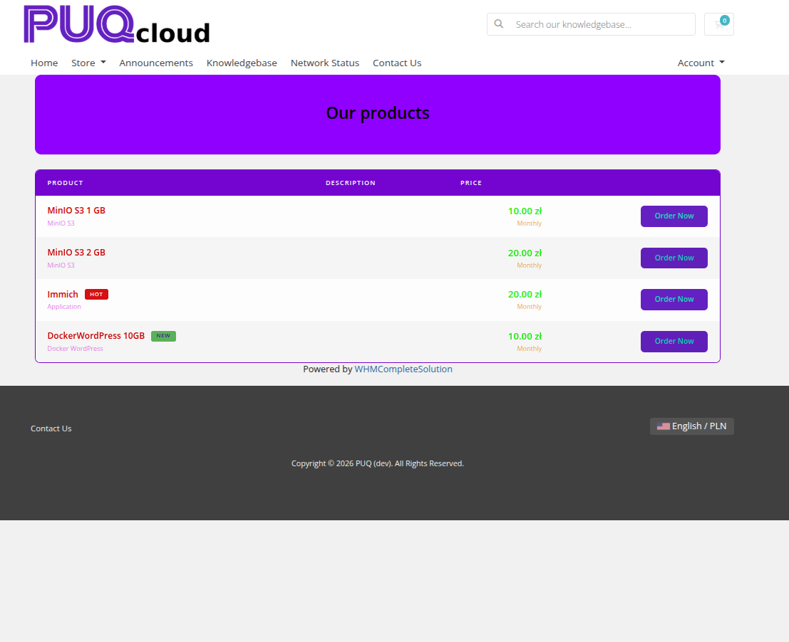
*product-cards-07-style-line.png*

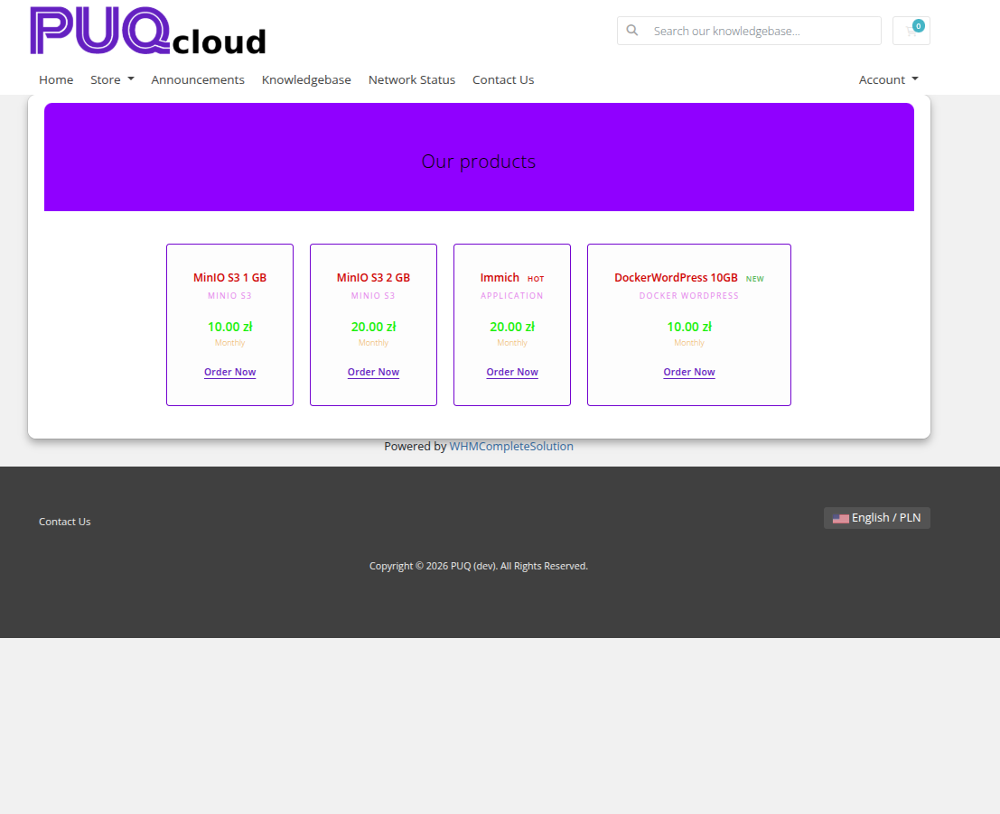
*product-cards-08-style-tile.png*

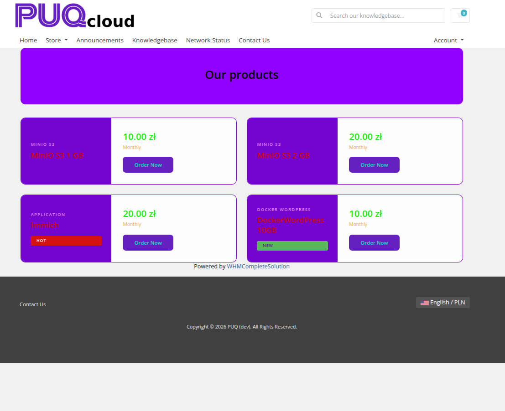
*product-cards-09-style-split.png*

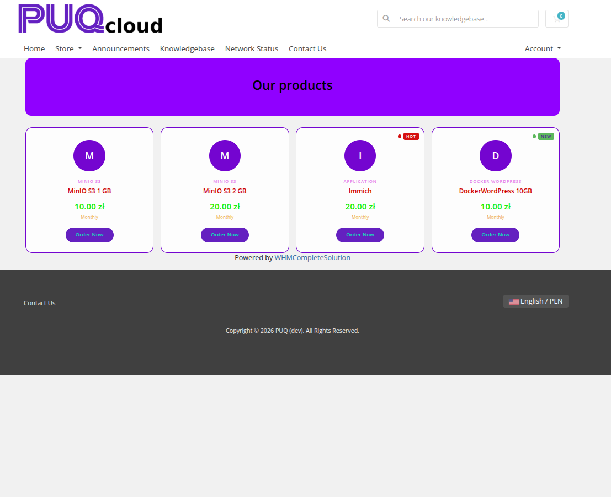
*product-cards-10-style-minimal.png*

*product-cards-11-style-wave.png*

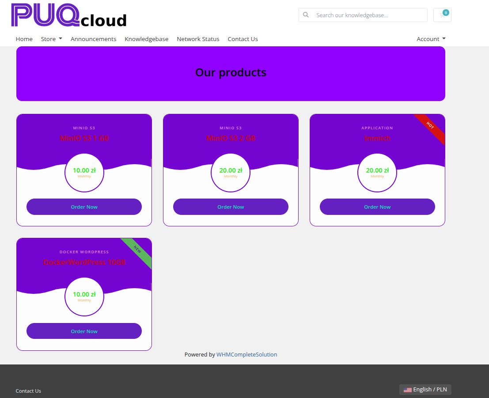
*product-cards-12-style-wave-alt.png*

---

## Settings

### Layout

| Setting | Description |
|---------|-------------|
| **width** | Widget container width (e.g. `100%`, `1200px`) |
| **margin-top** | Top margin of the widget block |
| **margin-bottom** | Bottom margin of the widget block |
| **Style** | Visual style template (`puq`, `puq-bold`, `puq-border`, `puq-glass`, `puq-line`, `puq-list`, `puq-minimal`, `puq-split`, `puq-tile`, `puq-wave`) |
| **Card width** | Fixed width for each product card (e.g. `300px`) |

### Colors

| Setting | Description |
|---------|-------------|
| **Product name** (`color_1`) | Color of the product name text |
| **Group name** (`color_2`) | Color of the product group name text |
| **Price** (`color_3`) | Color of the price value |
| **Billing cycle** (`color_4`) | Color of the billing cycle label |
| **Description** (`color_5`) | Color of the product description text |
| **Card background** (`color_6`) | Background color of each product card |
| **Card border** (`color_7`) | Border color of each product card |

### Background

| Setting | Description |
|---------|-------------|
| **Background image** | URL of the background image for the widget container |
| **Background color** | Background color of the widget container |
| **Disable Shadow** | Remove the drop shadow from the widget container |
| **Disable Radius top** | Remove top corner rounding |
| **Disable Radius bottom** | Remove bottom corner rounding |
| **Disable Background** | Remove the background panel entirely |
| **Full width** | Stretch the widget to the full page width |

### Header

| Setting | Description |
|---------|-------------|
| **Header text** | Main heading text above the product cards (e.g. `Our products`) |
| **Header text color** | Color of the heading text |
| **Header description** | Subheading or description text below the main heading |
| **Header description color** | Color of the description text |
| **Disable header** | Hide the header section |
| **Header background image** | URL of a background image for the header area |
| **Header background color** | Background color of the header area |
| **Fix header background** | Fix the header background image during scroll (parallax) |
| **Darken header background** | Apply a darkening overlay on the header background |

### Badges

| Setting | Description |
|---------|-------------|
| **Hot label** | Text for the "Hot" badge (e.g. `Hot`) |
| **Hot color** | Background color of the Hot badge |
| **Hot text color** | Text color of the Hot badge |
| **New label** | Text for the "New" badge (e.g. `New`) |
| **New color** | Background color of the New badge |
| **New text color** | Text color of the New badge |
| **Sale label** | Text for the "Sale" badge (e.g. `Sale`) |
| **Sale color** | Background color of the Sale badge |
| **Sale text color** | Text color of the Sale badge |

### Order Now Button

| Setting | Description |
|---------|-------------|
| **Order Now button name** | Label for the order button (e.g. `Order Now`) |
| **Button color** | Background color of the order button |
| **Text color** | Text color of the order button |

### Product Source

| Setting | Description |
|---------|-------------|
| **Show products from group** | Automatically load all products from a WHMCS product group |
| **Show price** | Which price to display: `First price`, `Best price`, `Monthly price`, `Semi annual price`, `Annual price`, `Biennially price`, or `Triennially price` |
| **Show behind the list** | Append the auto-loaded group products after the manually listed products |

### Manual Products

Use the **+** button to add individual products manually. Each product row allows you to select a product by name/image and configure its display options. Items can be reordered with the up/down arrows and removed with the delete button.
