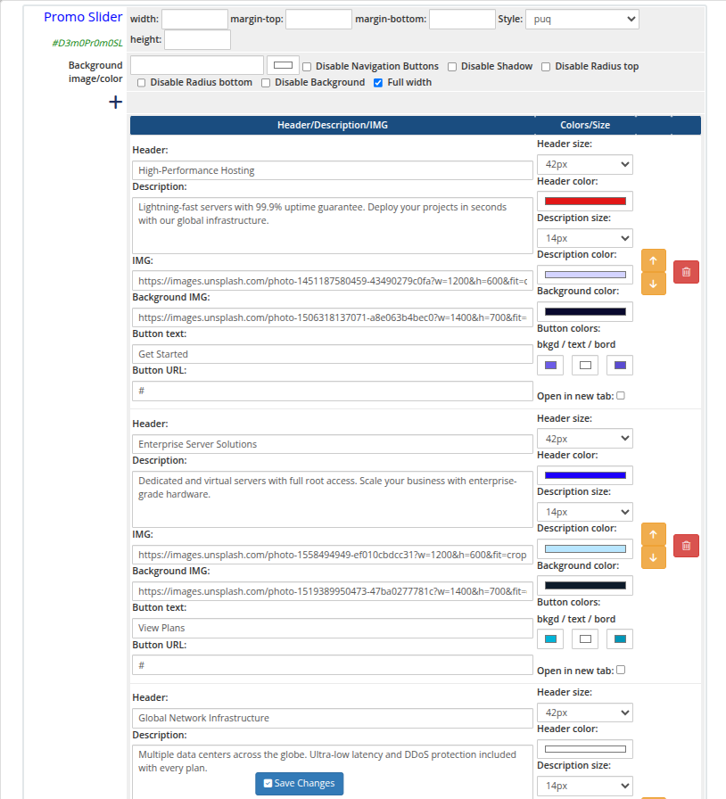
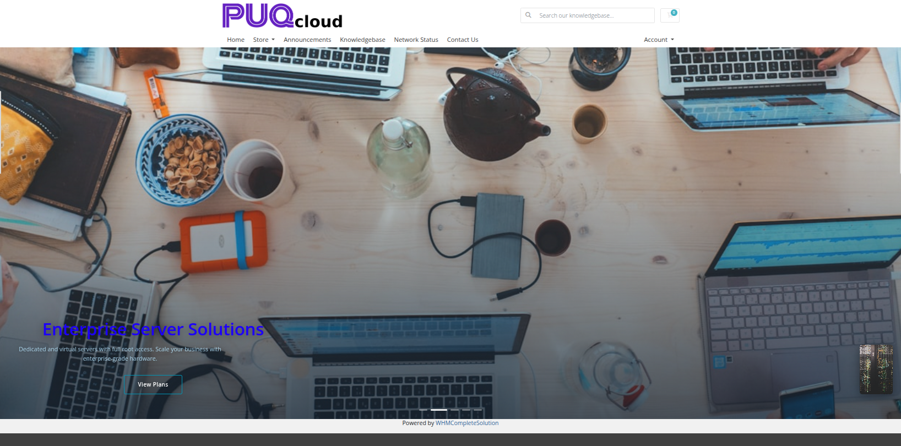
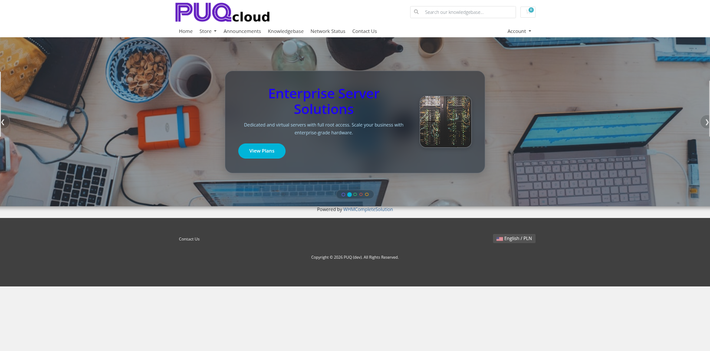
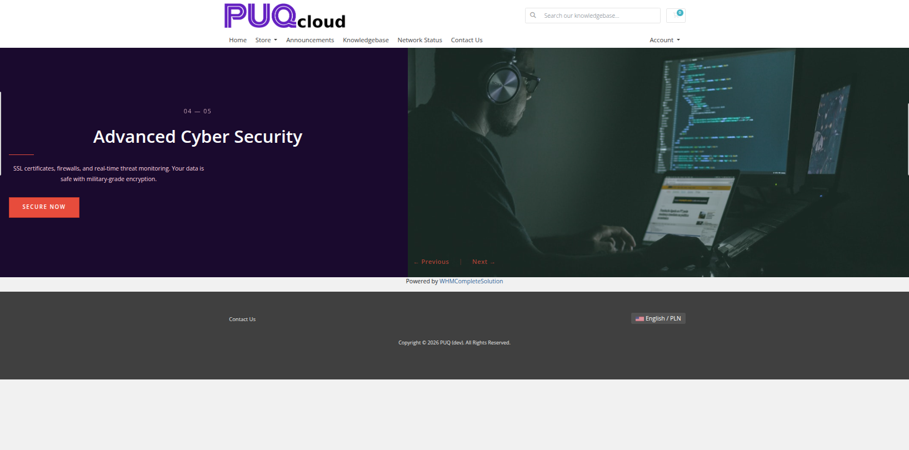
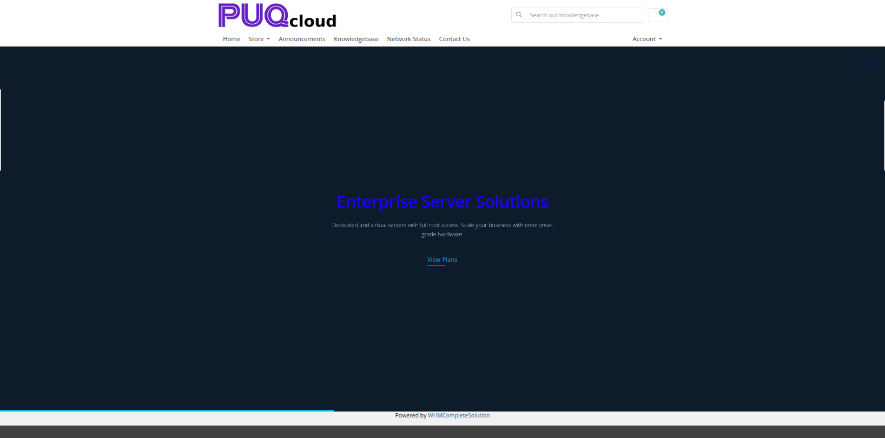
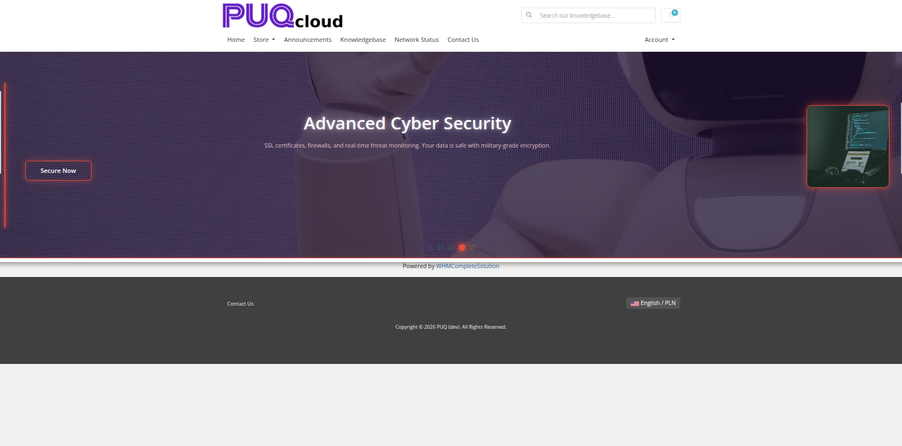
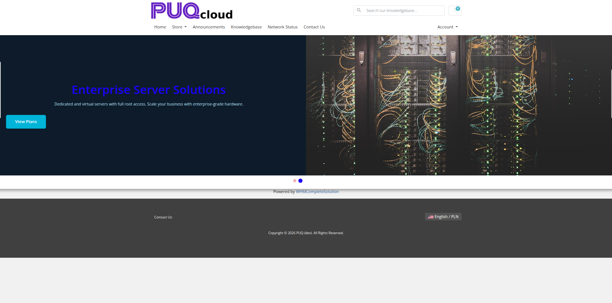

# Promo Slider

### Page Manager addon **[WHMCS](https://puqcloud.com/link.php?id=77)**
#####  [Order now](https://puqcloud.com/store/whmcs-addon-modules) | [Download](https://download.puqcloud.com/WHMCS/addons/PUQ_WHMCS-Page-Manager/) | [FAQ](https://community.puqcloud.com/)

The Promo Slider widget renders an image carousel with text overlays and call-to-action buttons. Each slide can have a heading, description, foreground image, background image, and a button link. Ten visual styles are available, including cinematic, parallax, and split-screen layouts.

---

## Admin View

*promo-slider-01-admin.png*

---

## Frontend Styles

*promo-slider-02-style-default.png*

*promo-slider-03-style-cards.png*

*promo-slider-04-style-cinema.png*

*promo-slider-05-style-glass.png*

*promo-slider-06-style-hero.png*

*promo-slider-07-style-kenburns.png*

*promo-slider-08-style-magazine.png*

*promo-slider-09-style-minimal.png*

*promo-slider-10-style-neon.png*

*promo-slider-11-style-split.png*

*promo-slider-12-style-split-alt.png*

---

## Settings

### Layout

| Setting | Description |
|---------|-------------|
| **width** | Widget container width (e.g. `100%`, `1200px`) |
| **margin-top** | Top margin of the widget block |
| **margin-bottom** | Bottom margin of the widget block |
| **Style** | Visual style template (`puq`, `puq-cards`, `puq-cinema`, `puq-glass`, `puq-hero`, `puq-kenburns`, `puq-magazine`, `puq-minimal`, `puq-neon`, `puq-split`) |
| **height** | Slider height (e.g. `500px`) |

### Background & Options

| Setting | Description |
|---------|-------------|
| **Background image** | URL of the background image for the widget container |
| **Background color** | Background color of the widget container |
| **Disable Navigation Buttons** | Hide the previous/next arrow buttons on the slider |
| **Disable Shadow** | Remove the drop shadow from the widget container |
| **Disable Radius top** | Remove top corner rounding |
| **Disable Radius bottom** | Remove bottom corner rounding |
| **Disable Background** | Remove the background panel entirely |
| **Full width** | Stretch the widget to the full page width |

### Slides

Use the **+** button to add slide entries. Each slide has the following fields:

| Field | Description |
|-------|-------------|
| **Header** | Heading text for the slide |
| **Header size** | Font size selector for the heading |
| **Header color** | Color of the heading text |
| **Description** | Body text or subtitle for the slide |
| **Description size** | Font size selector for the description |
| **Description color** | Color of the description text |
| **IMG** | URL of the foreground image displayed on the slide |
| **Background IMG** | URL of the background image for the slide |
| **Button text** | Label for the call-to-action button |
| **Button URL** | Destination URL for the call-to-action button |

Slides can be reordered with the up/down arrows and removed with the delete button.
