# Question Answer

### Page Manager addon **[WHMCS](https://puqcloud.com/link.php?id=77)**
#####  [Order now](https://puqcloud.com/store/whmcs-addon-modules) | [Download](https://download.puqcloud.com/WHMCS/addons/PUQ_WHMCS-Page-Manager/) | [FAQ](https://community.puqcloud.com/)

The Question Answer widget renders a FAQ or Q&A section with expandable answers. Each entry has a question and a rich-text answer. Ten visual styles are available, including accordion, grid, bubble, tabbed, and timeline layouts.

---

## Admin View

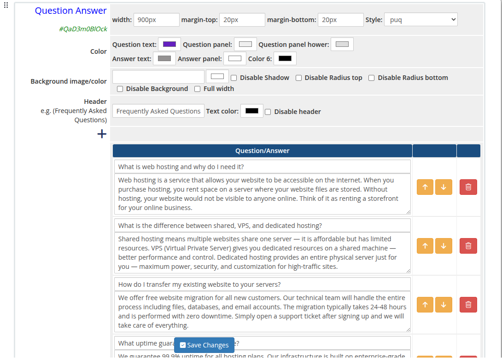
*question-answer-01-admin.png*

---

## Frontend Styles

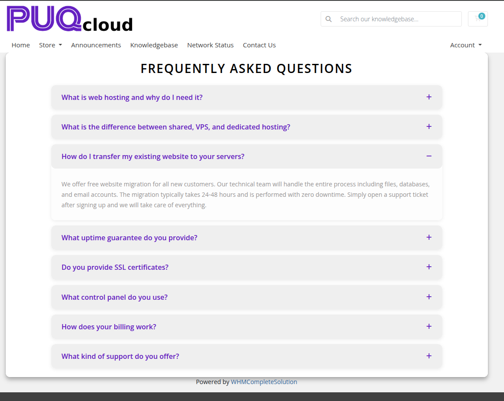
*question-answer-02-style-default.png*

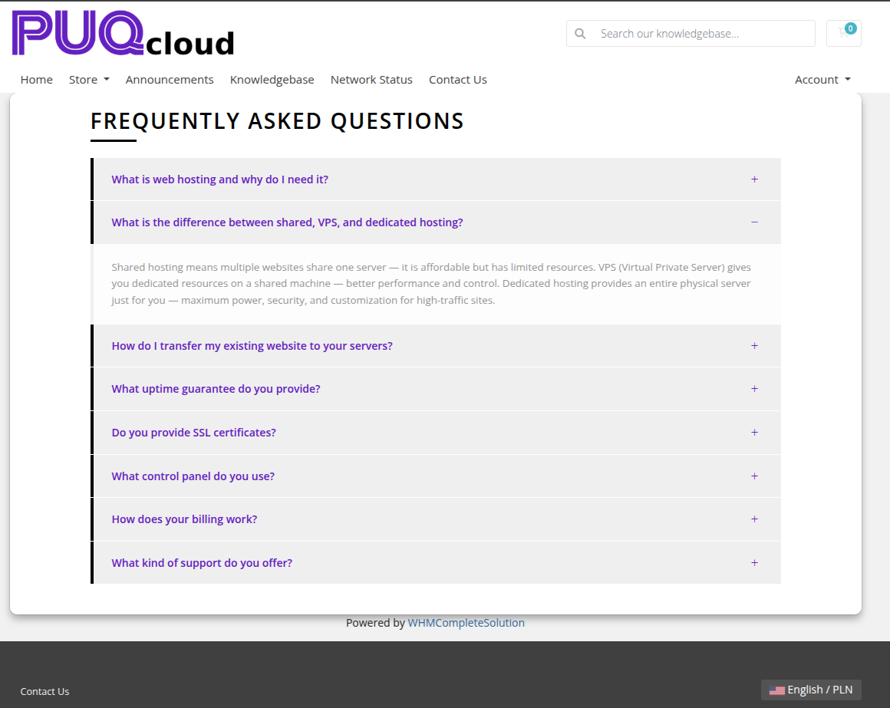
*question-answer-03-style-border.png*

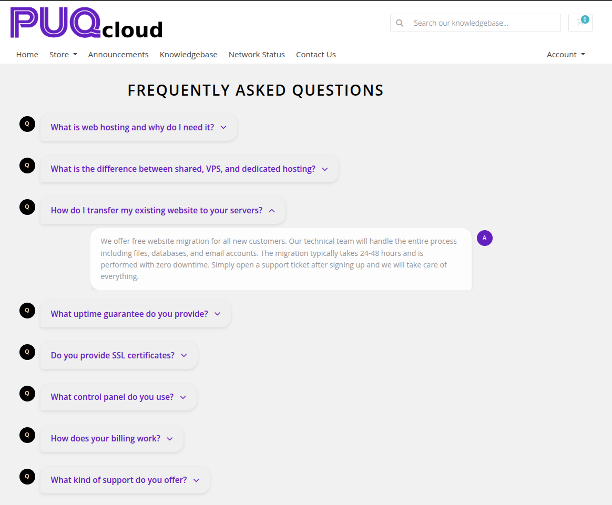
*question-answer-04-style-bubble.png*

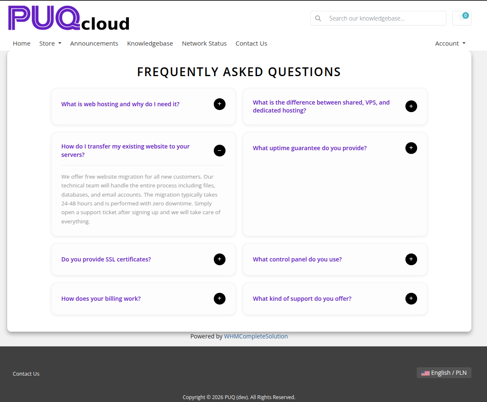
*question-answer-05-style-grid.png*

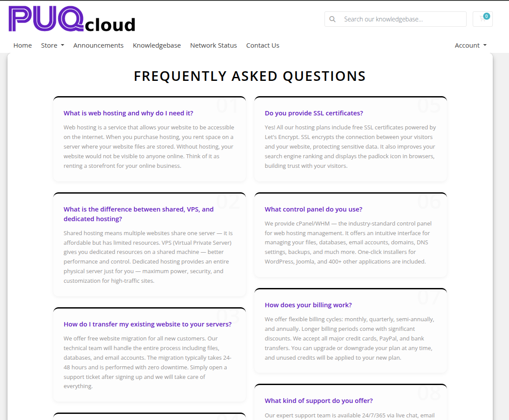
*question-answer-06-style-minimal.png*

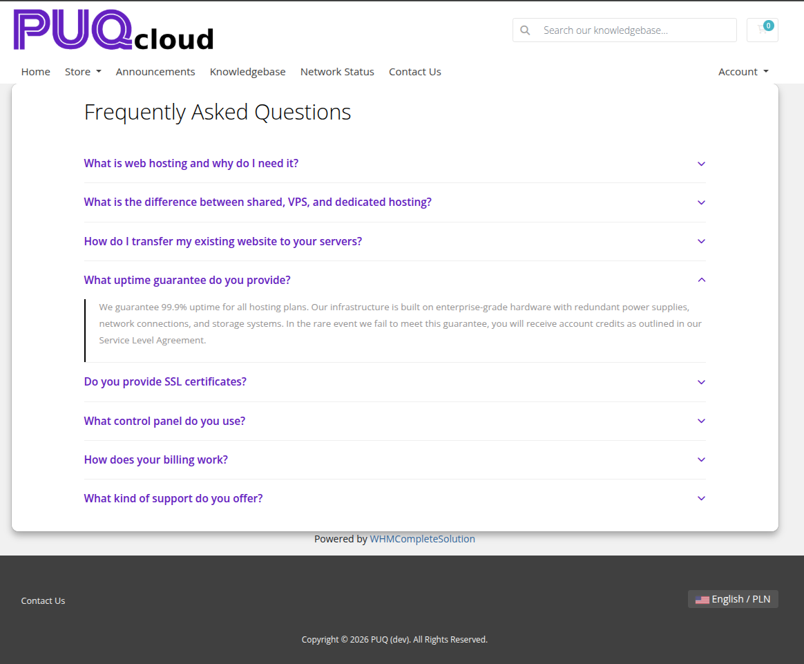
*question-answer-07-style-cards.png*

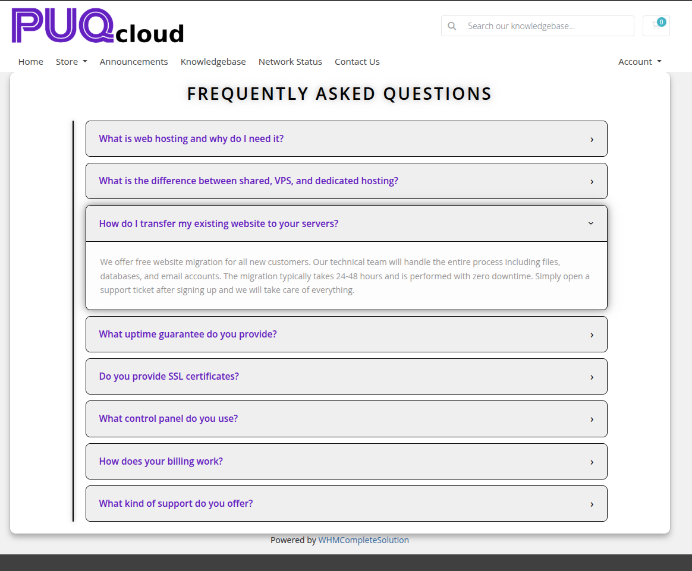
*question-answer-08-style-neon.png*

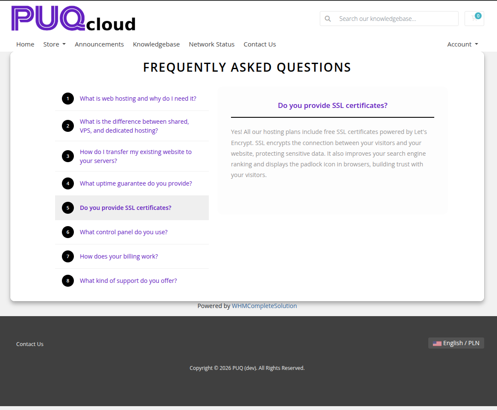
*question-answer-09-style-tabs.png*

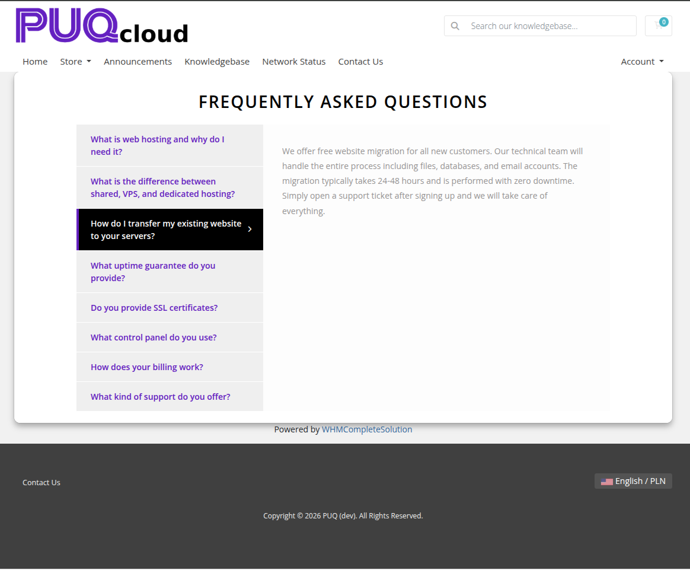
*question-answer-10-style-timeline.png*

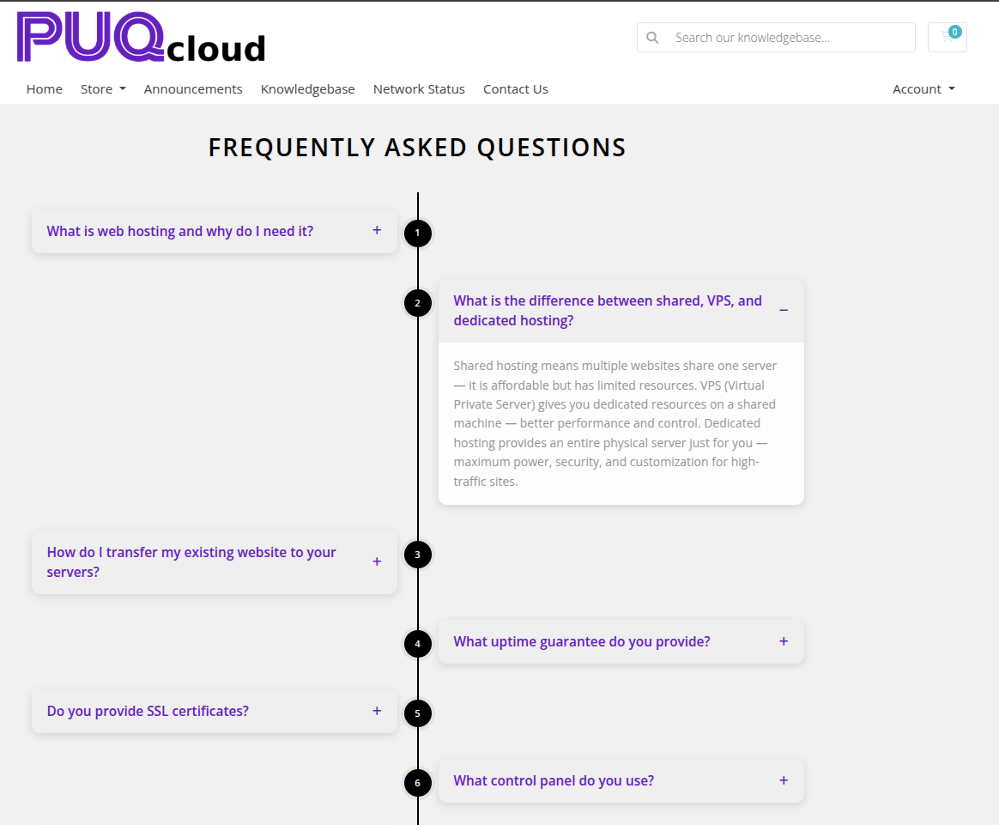
*question-answer-11-style-split.png*

---

## Settings

### Layout

| Setting | Description |
|---------|-------------|
| **width** | Widget container width (e.g. `100%`, `900px`) |
| **margin-top** | Top margin of the widget block |
| **margin-bottom** | Bottom margin of the widget block |
| **Style** | Visual style template (`puq`, `puq-border`, `puq-bubble`, `puq-cards`, `puq-grid`, `puq-minimal`, `puq-neon`, `puq-split`, `puq-tabs`, `puq-timeline`) |

### Colors

| Setting | Description |
|---------|-------------|
| **Question text** (`color_1`) | Color of the question text |
| **Question panel** (`color_2`) | Background color of the question panel |
| **Question panel hover** (`color_3`) | Background color of the question panel on hover |
| **Answer text** (`color_4`) | Color of the answer text |
| **Answer panel** (`color_5`) | Background color of the answer panel |
| **Color 6** (`color_6`) | Additional accent color used by certain styles |

### Background

| Setting | Description |
|---------|-------------|
| **Background image** | URL of the background image for the widget container |
| **Background color** | Background color of the widget container |
| **Disable Shadow** | Remove the drop shadow from the widget container |
| **Disable Radius top** | Remove top corner rounding |
| **Disable Radius bottom** | Remove bottom corner rounding |
| **Disable Background** | Remove the background panel entirely |
| **Full width** | Stretch the widget to the full page width |

### Header

| Setting | Description |
|---------|-------------|
| **Header** | Heading text above the Q&A list (e.g. `Frequently Asked Questions`) |
| **Text color** | Color of the header text |
| **Disable header** | Hide the header text |

### Q&A Items

Use the **+** button to add question and answer pairs. Each row contains:

| Field | Description |
|-------|-------------|
| **Question** | The question text displayed in the collapsed panel |
| **Answer** | The answer content shown when the panel is expanded (supports rich text) |

Items can be reordered with the up/down arrows and removed with the delete button.
