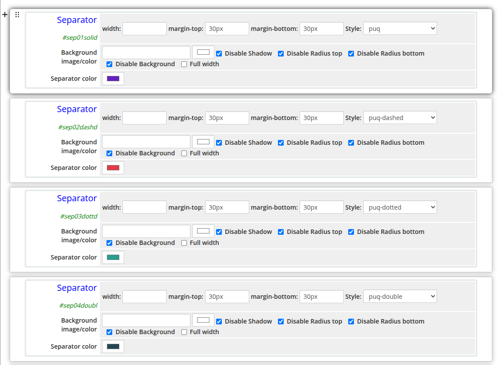
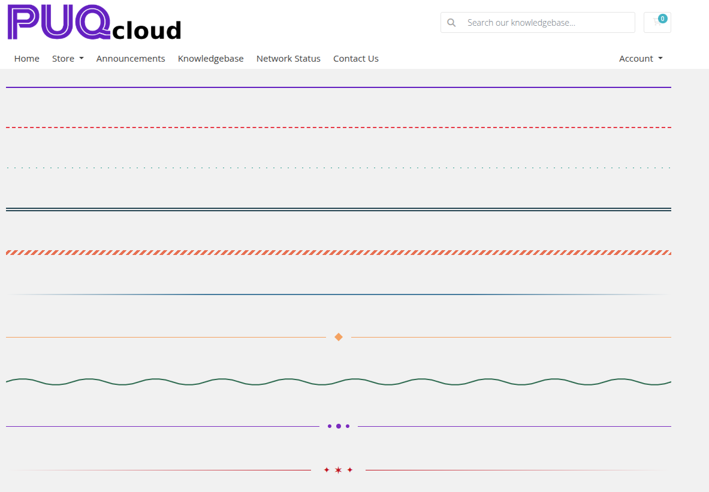

# Separator

### Page Manager addon **[WHMCS](https://puqcloud.com/link.php?id=77)**
#####  [Order now](https://puqcloud.com/store/whmcs-addon-modules) | [Download](https://download.puqcloud.com/WHMCS/addons/PUQ_WHMCS-Page-Manager/) | [FAQ](https://community.puqcloud.com/)

The Separator widget inserts a decorative dividing line between page sections. Ten visual styles are available, including dashed, dotted, double, gradient, wave, zigzag, diamond, and ornament variants.

---

## Admin View

*separator-admin.png*

---

## Frontend View

*separator-frontend.png*

---

## Styles

10 style templates are available: `puq` (default), `puq-dashed`, `puq-diamond`, `puq-dots`, `puq-dotted`, `puq-double`, `puq-gradient`, `puq-ornament`, `puq-wave`, `puq-zigzag`.

---

## Settings

### Layout

| Setting | Description |
|---------|-------------|
| **width** | Widget container width (e.g. `100%`, `800px`) |
| **margin-top** | Top margin of the widget block |
| **margin-bottom** | Bottom margin of the widget block |
| **Style** | Visual style template (`puq`, `puq-dashed`, `puq-diamond`, `puq-dots`, `puq-dotted`, `puq-double`, `puq-gradient`, `puq-ornament`, `puq-wave`, `puq-zigzag`) |

### Background

| Setting | Description |
|---------|-------------|
| **Background image** | URL of the background image for the widget container |
| **Background color** | Background color of the widget container |
| **Disable Shadow** | Remove the drop shadow from the widget container |
| **Disable Radius top** | Remove top corner rounding |
| **Disable Radius bottom** | Remove bottom corner rounding |
| **Disable Background** | Remove the background panel entirely |
| **Full width** | Stretch the widget to the full page width |

### Separator

| Setting | Description |
|---------|-------------|
| **Separator color** | Color of the decorative line or shape |
