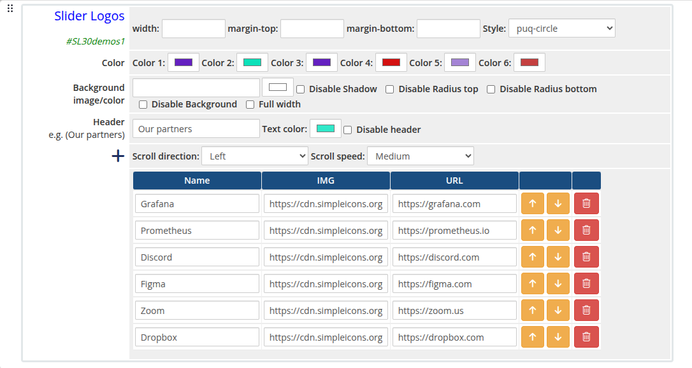
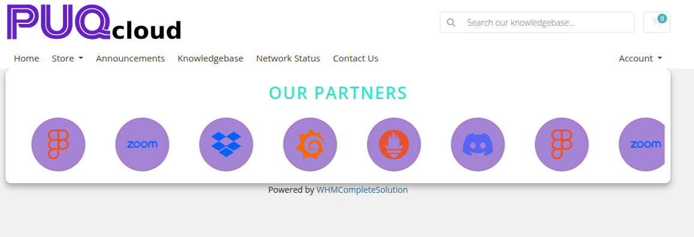

# Slider Logos

### Page Manager addon **[WHMCS](https://puqcloud.com/link.php?id=77)**
#####  [Order now](https://puqcloud.com/store/whmcs-addon-modules) | [Download](https://download.puqcloud.com/WHMCS/addons/PUQ_WHMCS-Page-Manager/) | [FAQ](https://community.puqcloud.com/)

The Slider Logos widget renders a horizontally scrolling logo carousel. Logos are automatically duplicated to create a seamless infinite loop. Each logo entry supports a name, image URL, and an optional link.

---

## Admin Settings

*slider-logos-admin.png*

---

## Frontend

*slider-logos-frontend.png*

---

## Settings

### Color Settings

| Setting | Type | Default | Description |
|---------|------|---------|-------------|
| **color_1** | color | `#6420c0` | Primary accent color |
| **color_2** | color | `#0de1b9` | Secondary accent color |
| **color_3** | color | `#6420c0` | Tertiary accent color |
| **color_4** | color | `#d41111` | Fourth accent color |
| **color_5** | color | `#a484d5` | Fifth accent color |
| **color_6** | color | `#000000` | Sixth accent color |

---

### Header

| Setting | Type | Default | Description |
|---------|------|---------|-------------|
| **header** | text | `Our partners` | Heading text displayed above the logo strip |
| **header_text_color** | color | `#000000` | Color of the header text |
| **disable_header** | checkbox | off | Hide the header entirely |

---

### Scroll Settings

| Setting | Type | Default | Description |
|---------|------|---------|-------------|
| **scroll** | select | `left` | Scroll direction: `left` or `right` |
| **scroll_speed** | select | `20` | Animation speed: `5` (Very fast), `10` (Fast), `20` (Medium), `30` (Slowly), `40` (So slow), `60` (Very Very Slow) |

---

### Logos

Each logo entry is a row in the visual editor with the following fields:

| Field | Description |
|-------|-------------|
| **logo_name** | Display name of the logo (used as alt text and tooltip) |
| **logo_img** | URL of the logo image |
| **logo_url** | Optional link URL when the logo is clicked |

Logos can be added, removed, and reordered using the visual editor.

---

### Layout Settings

| Setting | Type | Default | Description |
|---------|------|---------|-------------|
| **width** | text | — | CSS width of the widget container (e.g. `800px`, `100%`) |
| **margin_top** | text | — | CSS top margin (e.g. `20px`) |
| **margin_bottom** | text | — | CSS bottom margin (e.g. `20px`) |
| **style** | select | `puq` | Visual style template |
| **background_image** | text | — | URL of the background image |
| **background_color** | color | `#ffffff` | Background color of the widget container |
| **disable_background_shadow** | checkbox | off | Remove the drop shadow from the container |
| **disable_background_radius_top** | checkbox | off | Remove the top border radius from the container |
| **disable_background_radius_bottom** | checkbox | off | Remove the bottom border radius from the container |
| **disable_background** | checkbox | off | Disable the background container entirely |
| **full_width** | checkbox | off | Stretch the widget to the full page width |

---

## Style Templates

| Template | Description |
|----------|-------------|
| `puq` | Default logo strip style |
| `puq-border` | Logos displayed with a border frame |
| `puq-cards` | Logos rendered inside card containers |
| `puq-circle` | Logos cropped and displayed in circular frames |
| `puq-fade` | Fade transition effect on logo edges |
| `puq-grayscale` | Logos displayed in grayscale, colorized on hover |
| `puq-grid` | Logos arranged in a grid layout |
| `puq-neon` | Neon glow effect on logos |
| `puq-ribbon` | Logos displayed with a ribbon overlay |
| `puq-tooltip` | Logos show a tooltip with the logo name on hover |
