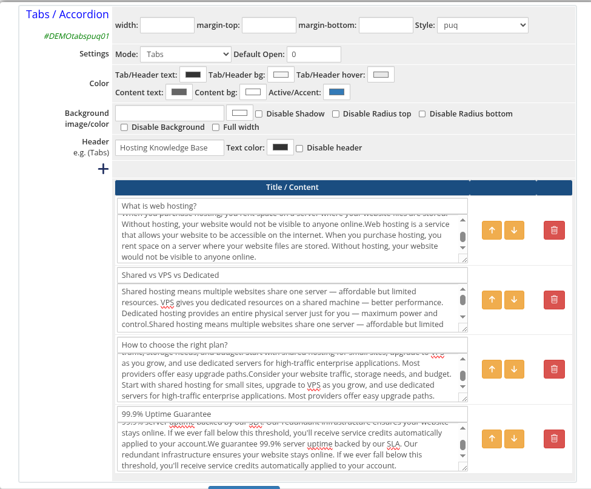
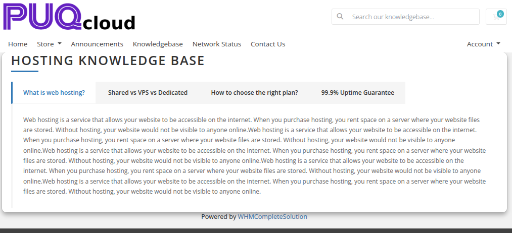
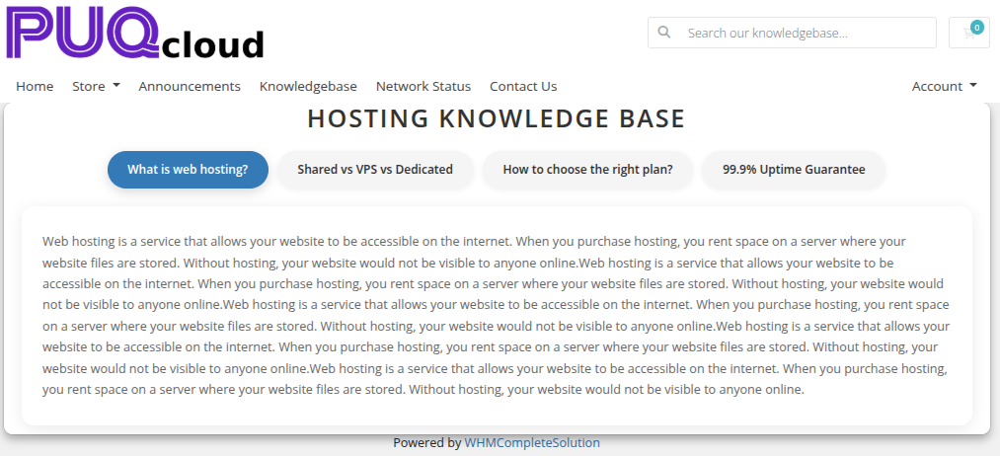
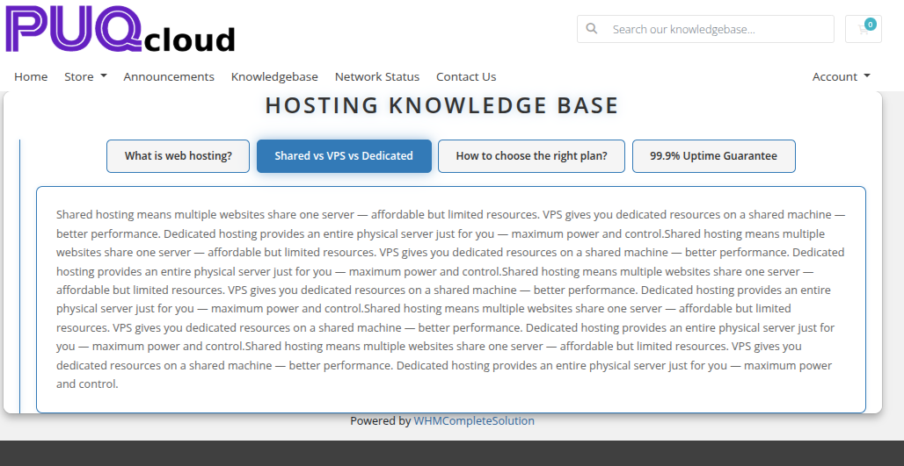

# Tabs / Accordion

### Page Manager addon **[WHMCS](https://puqcloud.com/link.php?id=77)**
#####  [Order now](https://puqcloud.com/store/whmcs-addon-modules) | [Download](https://download.puqcloud.com/WHMCS/addons/PUQ_WHMCS-Page-Manager/) | [FAQ](https://community.puqcloud.com/)

The Tabs / Accordion widget renders content sections that are toggled by clicking a tab or accordion header. It supports two modes — tabbed navigation and collapsible accordion — with rich HTML content in each section body.

---

## Admin Settings

*tabs-accordion-01-admin.png*

---

## Style Templates

*tabs-accordion-02-style-default.png*

*tabs-accordion-03-style-border.png*

*tabs-accordion-04-style-cards.png*

*tabs-accordion-05-style-minimal.png*

*tabs-accordion-06-style-neon.png*

---

## Settings

### Content Settings

| Setting | Type | Default | Description |
|---------|------|---------|-------------|
| **mode** | select | `accordion` | Display mode: `tabs` (horizontal tab bar) or `accordion` (collapsible sections) |
| **default_open** | number | `0` | Zero-based index of the tab or section to open by default |

---

### Color Settings

| Setting | Type | Default | Description |
|---------|------|---------|-------------|
| **color_1** | color | `#333333` | Tab or accordion header text color |
| **color_2** | color | `#f5f5f5` | Tab or accordion header background color |
| **color_3** | color | `#e8e8e8` | Tab or accordion header hover color |
| **color_4** | color | `#666666` | Content panel text color |
| **color_5** | color | `#ffffff` | Content panel background color |
| **color_6** | color | `#337ab7` | Active tab or accordion accent color |

---

### Header

| Setting | Type | Default | Description |
|---------|------|---------|-------------|
| **header** | text | `Tabs` | Heading text displayed above the widget |
| **header_text_color** | color | `#333333` | Color of the header text |
| **disable_header** | checkbox | off | Hide the header entirely |

---

### Items

Each item is a row in the visual editor with the following fields:

| Field | Description |
|-------|-------------|
| **title** | Label shown on the tab button or accordion header |
| **content** | Rich HTML content displayed in the panel body (stored base64-encoded) |

Items can be added, removed, and reordered using the visual editor.

---

### Layout Settings

| Setting | Type | Default | Description |
|---------|------|---------|-------------|
| **width** | text | — | CSS width of the widget container (e.g. `800px`, `100%`) |
| **margin_top** | text | — | CSS top margin (e.g. `20px`) |
| **margin_bottom** | text | — | CSS bottom margin (e.g. `20px`) |
| **style** | select | `puq` | Visual style template |
| **background_image** | text | — | URL of the background image |
| **background_color** | color | `#ffffff` | Background color of the widget container |
| **disable_background_shadow** | checkbox | off | Remove the drop shadow from the container |
| **disable_background_radius_top** | checkbox | off | Remove the top border radius from the container |
| **disable_background_radius_bottom** | checkbox | off | Remove the bottom border radius from the container |
| **disable_background** | checkbox | off | Disable the background container entirely |
| **full_width** | checkbox | off | Stretch the widget to the full page width |
