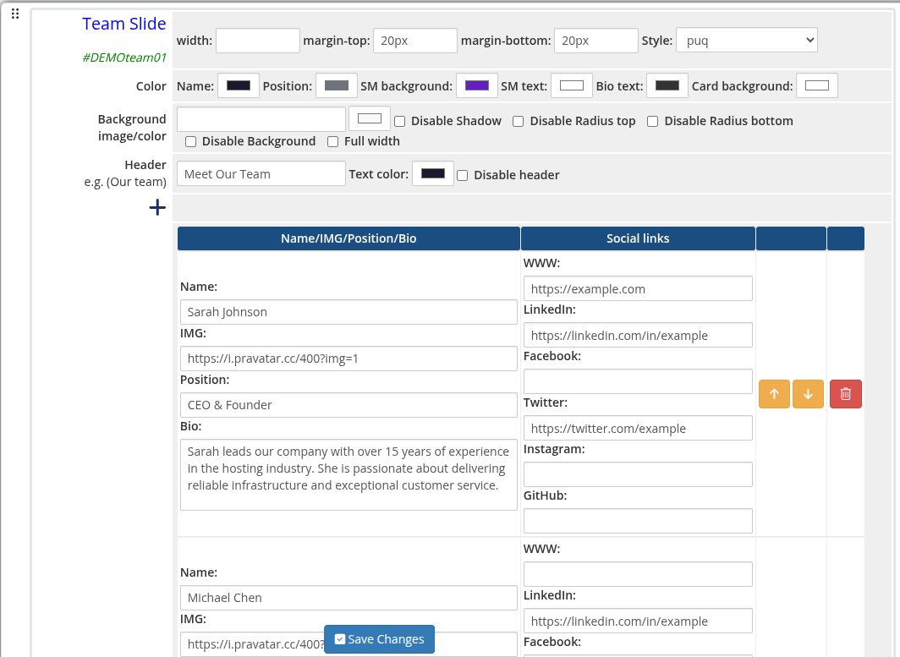
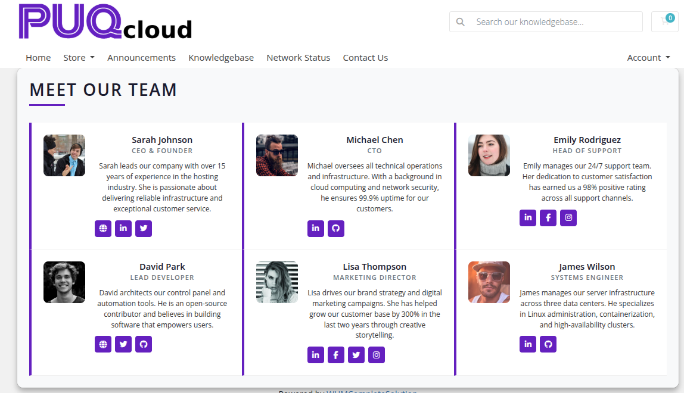

# Team Slide

### Page Manager addon **[WHMCS](https://puqcloud.com/link.php?id=77)**
#####  [Order now](https://puqcloud.com/store/whmcs-addon-modules) | [Download](https://download.puqcloud.com/WHMCS/addons/PUQ_WHMCS-Page-Manager/) | [FAQ](https://community.puqcloud.com/)

The Team Slide widget renders a showcase of team members as cards or a slider. Each member entry supports a photo, name, position, biography, and links to social media profiles including LinkedIn, Facebook, Twitter, Instagram, GitHub, and a personal website.

---

## Admin Settings

*team-slide-01-admin.png*

---

## Style Templates

*team-slide-02-style-default.png*

*team-slide-03-style-border.png*

*team-slide-04-style-grayscale.png*

*team-slide-05-style-circle.png*

*team-slide-06-style-fade.png*

*team-slide-07-style-cards.png*

*team-slide-08-style-minimal.png*

*team-slide-09-style-grid.png*

*team-slide-10-style-neon.png*

*team-slide-11-style-ribbon.png*

*team-slide-12-style-tooltip.png*

---

## Settings

### Color Settings

| Setting | Type | Default | Description |
|---------|------|---------|-------------|
| **color_1** | color | — | Member name text color |
| **color_2** | color | — | Member position text color |
| **color_3** | color | — | Social media icon background color |
| **color_4** | color | — | Social media icon text color |
| **color_5** | color | — | Biography text color |
| **color_6** | color | — | Card background color |

---

### Header

| Setting | Type | Default | Description |
|---------|------|---------|-------------|
| **header** | text | `Our team` | Heading text displayed above the widget |
| **header_text_color** | color | `#000000` | Color of the header text |
| **disable_header** | checkbox | off | Hide the header entirely |

---

### Members

Each member is a row in the visual editor with the following fields:

| Field | Description |
|-------|-------------|
| **member_name** | Full name of the team member |
| **member_img** | URL of the member's photo |
| **member_position** | Job title or role |
| **member_bio** | Short biography or description |
| **member_www** | Personal or company website URL |
| **member_linkedin** | LinkedIn profile URL |
| **member_facebook** | Facebook profile URL |
| **member_twitter** | Twitter profile URL |
| **member_instagram** | Instagram profile URL |
| **member_github** | GitHub profile URL |

Members can be added, removed, and reordered using the visual editor.

---

### Layout Settings

| Setting | Type | Default | Description |
|---------|------|---------|-------------|
| **width** | text | — | CSS width of the widget container (e.g. `800px`, `100%`) |
| **margin_top** | text | — | CSS top margin (e.g. `20px`) |
| **margin_bottom** | text | — | CSS bottom margin (e.g. `20px`) |
| **style** | select | `puq` | Visual style template |
| **background_image** | text | — | URL of the background image |
| **background_color** | color | `#ffffff` | Background color of the widget container |
| **disable_background_shadow** | checkbox | off | Remove the drop shadow from the container |
| **disable_background_radius_top** | checkbox | off | Remove the top border radius from the container |
| **disable_background_radius_bottom** | checkbox | off | Remove the bottom border radius from the container |
| **disable_background** | checkbox | off | Disable the background container entirely |
| **full_width** | checkbox | off | Stretch the widget to the full page width |
