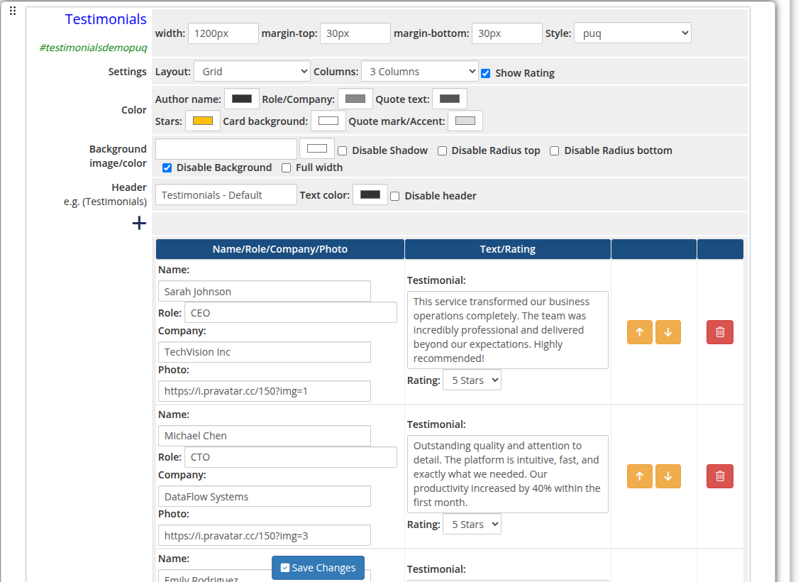

# Testimonials

### Page Manager addon **[WHMCS](https://puqcloud.com/link.php?id=77)**
#####  [Order now](https://puqcloud.com/store/whmcs-addon-modules) | [Download](https://download.puqcloud.com/WHMCS/addons/PUQ_WHMCS-Page-Manager/) | [FAQ](https://community.puqcloud.com/)

The Testimonials widget displays customer reviews and quotes with optional star ratings. It supports both a grid and slider layout and is fully configurable with colors, column count, and per-item photo, name, role, company, and testimonial text.

---

## Admin Settings

*testimonials-01-admin.png*

---

## Style Templates

*testimonials-02-style-default.png*

*testimonials-03-style-cards.png*

*testimonials-04-style-circle.png*

*testimonials-05-style-fade.png*

*testimonials-06-style-grayscale.png*

*testimonials-07-style-grid.png*

*testimonials-08-style-border.png*

*testimonials-09-style-neon.png*

*testimonials-10-style-tooltip.png*

---

## Settings

### Content Settings

| Setting | Type | Default | Description |
|---------|------|---------|-------------|
| **layout** | select | `grid` | Display mode: `grid` (static columns) or `slider` (carousel) |
| **columns** | select | `3` | Number of columns in grid layout: `1`, `2`, `3`, or `4` |
| **show_rating** | checkbox | off | Show star rating below each testimonial |

---

### Color Settings

| Setting | Type | Default | Description |
|---------|------|---------|-------------|
| **color_1** | color | — | Author name text color |
| **color_2** | color | — | Role and company text color |
| **color_3** | color | — | Testimonial quote text color |
| **color_4** | color | — | Star rating color |
| **color_5** | color | — | Card background color |
| **color_6** | color | — | Quote mark and accent color |

---

### Header

| Setting | Type | Default | Description |
|---------|------|---------|-------------|
| **header** | text | `Testimonials` | Heading text displayed above the widget |
| **header_text_color** | color | `#000000` | Color of the header text |
| **disable_header** | checkbox | off | Hide the header entirely |

---

### Items

Each testimonial is a row in the visual editor with the following fields:

| Field | Description |
|-------|-------------|
| **name** | Full name of the reviewer |
| **role** | Job title or role of the reviewer |
| **company** | Company or organization name |
| **photo_url** | URL of the reviewer's photo |
| **text** | Testimonial quote text (stored base64-encoded) |
| **rating** | Star rating: `1` through `5` stars |

Items can be added, removed, and reordered using the visual editor.

---

### Layout Settings

| Setting | Type | Default | Description |
|---------|------|---------|-------------|
| **width** | text | — | CSS width of the widget container (e.g. `800px`, `100%`) |
| **margin_top** | text | — | CSS top margin (e.g. `20px`) |
| **margin_bottom** | text | — | CSS bottom margin (e.g. `20px`) |
| **style** | select | `puq` | Visual style template |
| **background_image** | text | — | URL of the background image |
| **background_color** | color | `#ffffff` | Background color of the widget container |
| **disable_background_shadow** | checkbox | off | Remove the drop shadow from the container |
| **disable_background_radius_top** | checkbox | off | Remove the top border radius from the container |
| **disable_background_radius_bottom** | checkbox | off | Remove the bottom border radius from the container |
| **disable_background** | checkbox | off | Disable the background container entirely |
| **full_width** | checkbox | off | Stretch the widget to the full page width |
