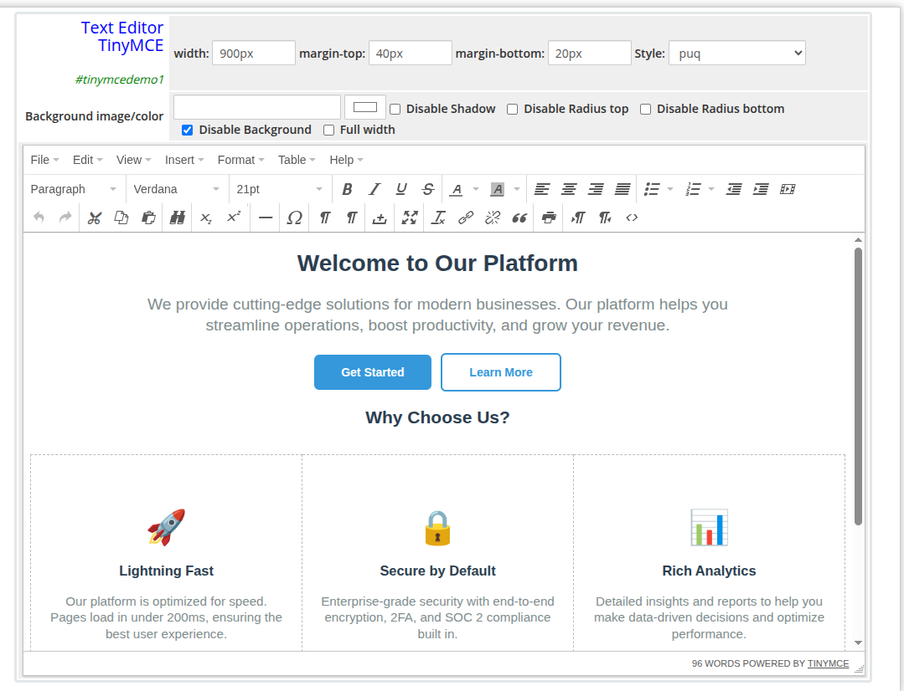

# Text Editor TinyMCE

### Page Manager addon **[WHMCS](https://puqcloud.com/link.php?id=77)**
#####  [Order now](https://puqcloud.com/store/whmcs-addon-modules) | [Download](https://download.puqcloud.com/WHMCS/addons/PUQ_WHMCS-Page-Manager/) | [FAQ](https://community.puqcloud.com/)

The Text Editor TinyMCE widget embeds a full WYSIWYG TinyMCE editor directly inside the EditorJS page editor. It allows rich HTML content to be authored visually and rendered on the frontend with full formatting support, including headings, lists, tables, images, links, and inline styles.

---

## Admin Settings

*text-editor-tinymce-admin.png*

---

## Frontend

*text-editor-tinymce-frontend.png*

---

## Settings

### Content Settings

| Setting | Type | Description |
|---------|------|-------------|
| **text** | rich HTML (TinyMCE editor) | Full HTML content authored in the WYSIWYG editor. Supports headings, bold, italic, lists, tables, images, links, blockquotes, and embedded iframes. |

---

### Layout Settings

| Setting | Type | Default | Description |
|---------|------|---------|-------------|
| **width** | text | — | CSS width of the widget container (e.g. `800px`, `100%`) |
| **margin_top** | text | — | CSS top margin (e.g. `20px`) |
| **margin_bottom** | text | — | CSS bottom margin (e.g. `20px`) |
| **style** | select | `puq` | Visual style template |
| **background_image** | text | — | URL of the background image |
| **background_color** | color | `#FFFFFF` | Background color of the widget container |
| **disable_background_shadow** | checkbox | off | Remove the drop shadow from the container |
| **disable_background_radius_top** | checkbox | off | Remove the top border radius from the container |
| **disable_background_radius_bottom** | checkbox | off | Remove the bottom border radius from the container |
| **disable_background** | checkbox | off | Disable the background container entirely |
| **full_width** | checkbox | off | Stretch the widget to the full page width |

---

## Style Templates

| Template | Description |
|----------|-------------|
| `puq` | Default style — renders content with the page theme colors |
| `invert_text_colors` | Inverts text colors for use on dark backgrounds |
