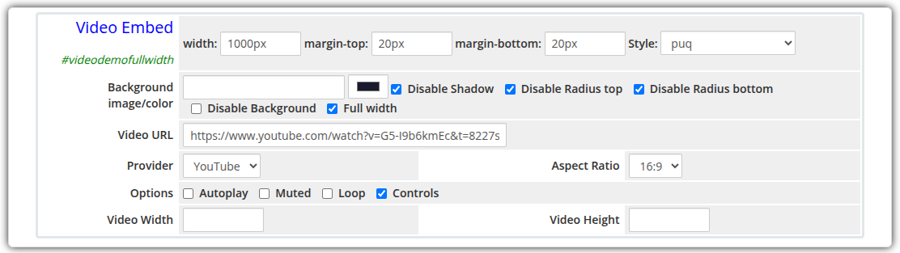
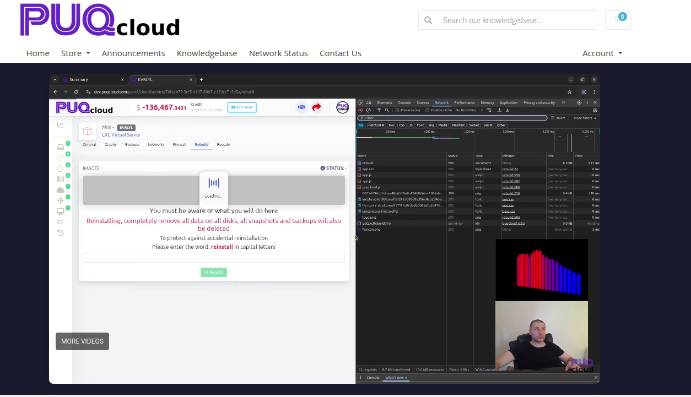

# Video Embed

### Page Manager addon **[WHMCS](https://puqcloud.com/link.php?id=77)**
#####  [Order now](https://puqcloud.com/store/whmcs-addon-modules) | [Download](https://download.puqcloud.com/WHMCS/addons/PUQ_WHMCS-Page-Manager/) | [FAQ](https://community.puqcloud.com/)

The Video Embed widget embeds a video from YouTube, Vimeo, or a custom URL into the page. The aspect ratio, playback options, and container dimensions are all configurable.

---

## Admin Settings

*video-embed-admin.png*

---

## Frontend

*video-embed-frontend.png*

---

## Settings

### Video Settings

| Setting | Type | Default | Description |
|---------|------|---------|-------------|
| **video_url** | text | — | URL of the video to embed (YouTube, Vimeo, or direct video file URL) |
| **provider** | select | `youtube` | Video provider: `youtube`, `vimeo`, or `custom` |
| **aspect_ratio** | select | `16:9` | Aspect ratio of the video player: `16:9`, `4:3`, or `1:1` |

---

### Playback Options

| Setting | Type | Default | Description |
|---------|------|---------|-------------|
| **autoplay** | checkbox | off | Start video playback automatically when the page loads |
| **muted** | checkbox | off | Mute the video audio (required for autoplay in most browsers) |
| **loop** | checkbox | off | Loop the video continuously |
| **controls** | checkbox | on | Show playback controls on the video player |

---

### Dimensions

| Setting | Type | Default | Description |
|---------|------|---------|-------------|
| **video_width** | text | — | Override width of the video player (e.g. `800px`, `100%`) |
| **video_height** | text | — | Override height of the video player (e.g. `450px`) |

---

### Layout Settings

| Setting | Type | Default | Description |
|---------|------|---------|-------------|
| **width** | text | — | CSS width of the widget container (e.g. `800px`, `100%`) |
| **margin_top** | text | — | CSS top margin (e.g. `20px`) |
| **margin_bottom** | text | — | CSS bottom margin (e.g. `20px`) |
| **style** | select | `puq` | Visual style template |
| **background_image** | text | — | URL of the background image |
| **background_color** | color | `#FFFFFF` | Background color of the widget container |
| **disable_background_shadow** | checkbox | off | Remove the drop shadow from the container |
| **disable_background_radius_top** | checkbox | off | Remove the top border radius from the container |
| **disable_background_radius_bottom** | checkbox | off | Remove the bottom border radius from the container |
| **disable_background** | checkbox | off | Disable the background container entirely |
| **full_width** | checkbox | off | Stretch the widget to the full page width |

---

## Style Templates

| Template | Description |
|----------|-------------|
| `puq` | Default video embed container style |
