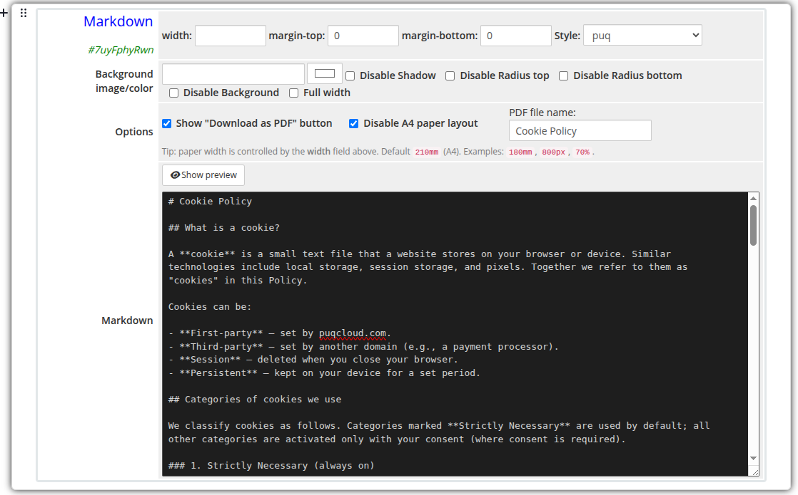
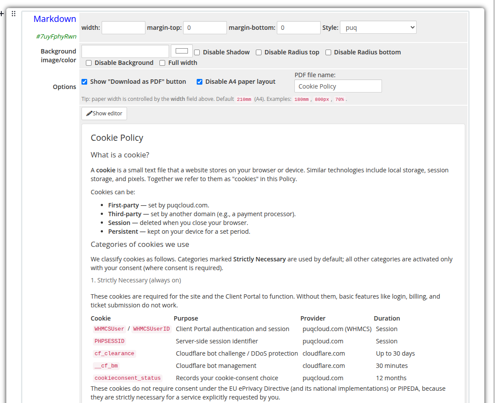
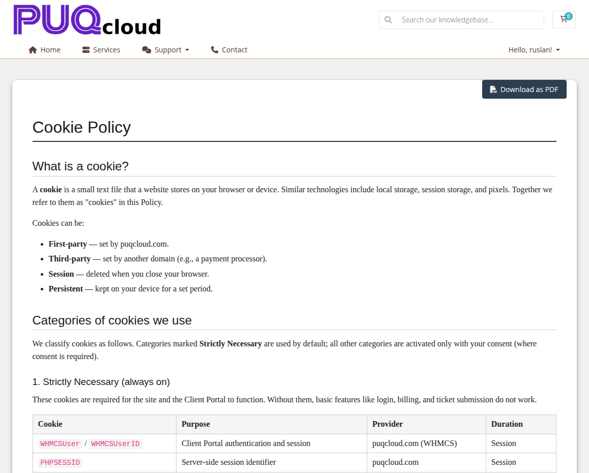
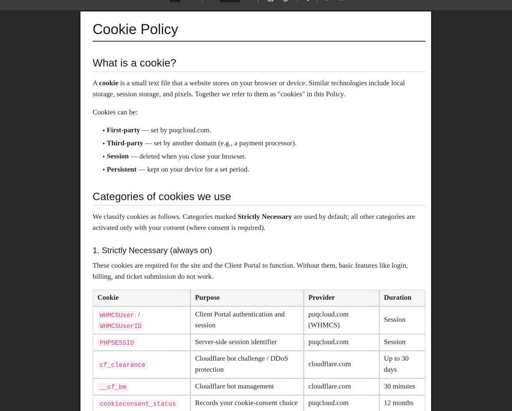

# Markdown

### Page Manager addon **[WHMCS](https://puqcloud.com/link.php?id=77)**
#####  [Order now](https://puqcloud.com/store/whmcs-addon-modules) | [Download](https://download.puqcloud.com/WHMCS/addons/PUQ_WHMCS-Page-Manager/) | [FAQ](https://community.puqcloud.com/)

The Markdown widget renders Markdown content as a printable A4-styled document on the client area. The admin side provides a Markdown source editor with a one-click preview toggle, and the frontend optionally exposes a "Download as PDF" button that produces an A4 PDF file.

---

## Admin Settings

The widget has two view modes that toggle with a single button.

### Editor mode

In editor mode the full Markdown source is shown in a syntax-friendly textarea. Click **Show preview** to switch to the rendered preview.

*markdown-admin.png*

### Preview mode

Preview mode renders the Markdown using the same parser as the frontend (without the A4 paper styling). Click **Show editor** to go back to the source.

*markdown-admin-preview.png*

---

## Frontend

On the client area the content is rendered inside an A4-sized paper element with a soft shadow and serif typography, similar to a printed document.

*markdown-frontend.png*

If the **Show "Download as PDF" button** option is enabled, a button is displayed above the document. Clicking it generates and downloads a real A4 PDF file produced from the rendered HTML.

*markdown-pdf.png*

---

## Settings

### Content

| Setting | Type | Default | Description |
|---------|------|---------|-------------|
| **markdown** | textarea | — | Markdown source. Standard Markdown syntax is supported (headings, lists, links, images, code blocks, tables, blockquotes, inline HTML). |

The `Show preview` / `Show editor` button switches between the source textarea and the rendered preview without leaving the editor.

---

### Document Options

| Setting | Type | Default | Description |
|---------|------|---------|-------------|
| **show_download_pdf** | checkbox | off | Show the **Download as PDF** button above the document on the frontend. |
| **disable_a4** | checkbox | off | Disable the A4 paper layout. The content is rendered as a regular full-width block instead of a fixed-size sheet. |
| **pdf_filename** | text | `document` | Base file name for the generated PDF (without `.pdf` extension). |

The **Download as PDF** button label is fully translatable via the addon language files (`Download as PDF`, `Generating...` keys).

---

### Layout Settings

| Setting | Type | Default | Description |
|---------|------|---------|-------------|
| **width** | text | `210mm` | Width of the paper sheet. Examples: `210mm` (A4), `180mm`, `800px`, `70%`. Numeric-only values are interpreted as a percentage. |
| **margin_top** | text | — | CSS top padding of the widget container (e.g. `20px`). |
| **margin_bottom** | text | — | CSS bottom padding of the widget container (e.g. `20px`). |
| **style** | select | `puq` | Visual style template. |
| **background_image** | text | — | URL of the background image rendered behind the paper. |
| **background_color** | color | `#FFFFFF` | Background color of the widget container. |
| **disable_background_shadow** | checkbox | off | Remove the drop shadow from the container. |
| **disable_background_radius_top** | checkbox | off | Remove the top border radius from the container. |
| **disable_background_radius_bottom** | checkbox | off | Remove the bottom border radius from the container. |
| **disable_background** | checkbox | off | Disable the background container entirely. |
| **full_width** | checkbox | off | Stretch the widget to the full page width. |

> **Tip:** Paper width is controlled by the **width** field. If the field is empty the default `210mm` (A4) is used. Use `mm`, `px`, or `%` units explicitly — bare numbers are treated as percentages.

---

## Style Templates

| Template | Description |
|----------|-------------|
| `puq` | Default A4 document style: serif typography, sans-serif headings, soft shadow, rounded corners. |

---

## Notes

- Markdown is parsed on the client side using **marked.js** (loaded from a CDN on first use and cached for further widgets on the page).
- PDF generation uses **html2pdf.js** (loaded on demand the first time the user clicks the download button).
- The widget is a standard EditorJS block — multiple Markdown blocks can be placed on the same page; each one keeps its own settings and content.
- For mobile screens (< 800px) the paper expands to 100% width automatically so it remains readable on small devices. The fixed A4 width is preserved on tablets and desktops.
- When **Disable A4 paper layout** is enabled, the document is rendered without the paper sheet (no fixed width, no shadow, no minimum height) — handy if you only need the Markdown rendering on a regular page section.
