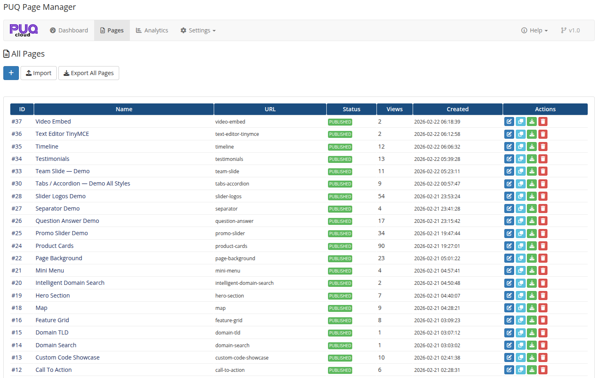

# Description

### PUQ Page Manager module **[WHMCS](https://puqcloud.com/link.php?id=77)**
##### [Order now](https://puqcloud.com/whmcs-addon-puq-page-manager.php) | [Download](https://download.puqcloud.com/WHMCS/addons/PUQ_WHMCS-Page-Manager/) | [Community](https://community.puqcloud.com/)

## PUQ Page Manager WHMCS Module

**PUQ Page Manager** is an addon module for WHMCS that allows you to create and manage custom pages using a powerful block widget editor (EditorJS). It includes 24 built-in widgets, multilingual support, SEO optimization, page analytics, password protection, revision history, and WHMCS page rewrites — all without writing any code.

---

## Key Features

- **Block Widget Editor** — visual page builder powered by EditorJS with drag-and-drop block management
- **24 Built-in Widgets** — Hero Section, Product Cards, Promo Slider, Testimonials, Timeline, FAQ, Team Slide, Contact Form, Tabs/Accordion, Markdown, and many more
- **Multiple Style Variants** — most widgets include 5–11 design styles selectable from the admin panel
- **Full Background Control** — every widget supports background image, color, shadow, and border-radius settings
- **Multilingual Pages** — create page translations for any language with translation status tracking (Translated / Needs Update / Not Translated)
- **SEO Optimization** — Open Graph meta tags, keywords, canonical URL, meta robots, Schema JSON-LD, custom CSS and JS per page
- **Page Analytics** — track page views, unique views, top pages, and views per day
- **Revision History** — automatic revision tracking with content preview and one-click restore
- **Password Protection** — protect individual pages with passwords, with customizable appearance (gradient presets, colors, icon, card style)
- **Visibility Control** — restrict pages to all visitors, guests only, clients only, or specific client groups
- **WHMCS Page Rewrites** — replace the WHMCS home page, footer, domain register page, or any custom URL pattern with your pages
- **Import / Export** — export individual pages or all pages as JSON, import on another WHMCS installation
- **Parent Pages & Sorting** — organize pages in a hierarchy with parent pages and custom sort order
- **Scheduled Publishing** — set pages as Draft, Published, Scheduled, or Archived
- **WHMCS Product Integration** — Product Cards and Domain widgets pull live pricing data from WHMCS
- **TinyMCE Widget** — embed rich HTML content using the TinyMCE WYSIWYG editor within the block editor
- **Custom Code Widget** — insert raw HTML, CSS, and JavaScript
- **License system** — online/offline license verification with graceful degradation
- **English language interface**

---

## System Requirements

| Requirement | Minimum |
|-------------|---------|
| **WHMCS** | 8.x+, 9.x+ |
| **PHP** | 7.4, 8.1, 8.2, 8.3, 8.4 |
| **ionCube Loader** | v15+ |

---

## Module Components

| Component | Type | Directory |
|-----------|------|-----------|
| Addon Module | `puq_page_manager` | `modules/addons/puq_page_manager/` |

---

## Links

- **Product page:** [https://puqcloud.com/whmcs-addon-puq-page-manager.php](https://puqcloud.com/whmcs-addon-puq-page-manager.php)
- **Documentation:** [https://doc.puq.info/books/page-manager-whmcs-addon](https://doc.puq.info/books/page-manager-whmcs-addon)
- **Support:** [https://puqcloud.com/submitticket.php](https://puqcloud.com/submitticket.php?step=2&deptid=1)
- **Community:** [https://community.puqcloud.com/](https://community.puqcloud.com/)

---

## Screenshots

### Admin Area — Dashboard

*02-dashboard.png*

### Admin Area — Pages

*03-pages.png*
